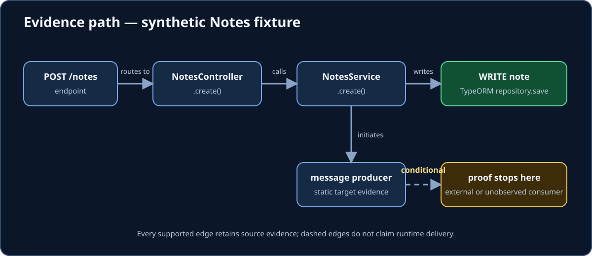

# Backend API Intelligence Engine

> **Evidence-backed blast radius for legacy NestJS systems.**

api-intel proves supported static paths to potential side-effect operations and
reports exactly where proof stops. It does not run the target application, observe
production behavior, or turn an unresolved path into a fact.



`0.1.0-alpha.1` is the first published **core alpha** release. Its exact npm bytes,
immutable GitHub release, and full-SHA Action passed the maintained published-artifact
verification matrix. Alpha contracts may still change with explicit migration notes.

## First useful result

After installing a reviewed package artifact, run one command from a NestJS project
whose dependencies are already installed:

```text
api-intel scan . --with-graph --open
```

This creates a canonical `.api-intel/analysis.json`, endpoint and trace Markdown, and
a self-contained offline graph. In headless environments, omit `--open`.

For a source checkout, use:

```text
corepack enable
pnpm install --frozen-lockfile --ignore-scripts
pnpm run build
pnpm run cli -- doctor example-nestjs-app
pnpm run cli -- scan example-nestjs-app --with-graph
```

Install the explicitly prerelease-tagged CLI with
`npm install --save-dev @fakrulauzaie/api-intel@alpha`. The maintained
[First Evidence-Backed Trace](docs/first-use-workflow.md) uses only the installed
`api-intel` binary and explains preflight, configuration preview, scanning, trace,
comparison, and policy checks.

## What it can prove

For tested static forms, Analysis v8 records deterministic, schema-validated facts and
source evidence for:

| Area                   | Supported facts                                                                                                                            |
| ---------------------- | ------------------------------------------------------------------------------------------------------------------------------------------ |
| HTTP entry points      | NestJS controllers, routes, parameters, guards, authorization metadata, and declared DTO/response shapes                                   |
| Local flow             | TypeChecker-resolved controller/service calls, bounded callback forwarding, and a bounded repository architecture view                     |
| Relational effects     | TypeORM repository operations, QueryBuilder terminals, opt-in PostgreSQL raw SQL, tables, columns, and bounded request-to-column influence |
| External calls         | `outbound_http` calls through supported Axios, fetch/Undici, and Nest `HttpService` forms                                                  |
| Async flow             | `in_process_event`, `job_queue`, and `microservice_message` producers, local handlers, activation state, and conditional effects           |
| Other resources        | package-proven cache-manager, ioredis, Redlock, and configured critical-section wrappers                                                   |
| Multi-service evidence | artifact-only stitching through an explicit broker topology, conditional system paths, comparison, potential impact, and policy findings   |

Every assertion points to retained evidence. Dynamic targets, ambiguous symbols,
unsupported callbacks, depth or fan-out limits, missing dependencies, and open-world
service boundaries remain diagnostics or explicit uncertainty.

### Proof stops

`api-intel` does **not** prove:

- runtime execution frequency, branch choice, payload values, database state, or
  successful transactions;
- network reachability, broker routing, delivery, acknowledgement, or remote handler
  execution;
- absence of behavior outside the documented static patterns;
- dead code from zero supported-root reach; or
- security, compliance, or architecture correctness beyond the exact configured rule.

`completed_with_gaps` is a successful partial result, not a completeness claim. See
[Current Limitations](docs/current-limitations.md) and
[Supported Static-Analysis Patterns](docs/supported-patterns.md) before relying on a
negative result.

## Refactoring workflow

1. Run `api-intel doctor .` and resolve missing TypeScript/framework declarations.
2. Scan the pre-refactor state into a dedicated output directory.
3. Make one bounded change and scan the post-refactor state separately.
4. Review semantic `diff`, potential `impact`, policy outcomes, diagnostics, and the
   evidence graph together.
5. Keep any distributed path conditional unless an explicit topology supplies an
   in-repository delivery candidate.

Installed-binary example:

```text
api-intel scan . --output .api-intel-before
# Apply the refactor.
api-intel scan . --output .api-intel-after
api-intel diff .api-intel-before/analysis.json .api-intel-after/analysis.json --format markdown --output .api-intel-change
api-intel impact .api-intel-before/analysis.json .api-intel-after/analysis.json --format markdown --output .api-intel-change
api-intel graph .api-intel-after/analysis.json --baseline .api-intel-before/analysis.json --output .api-intel-change --open
```

The project includes a maintained [small NestJS application](example-nestjs-app/README.md)
and a [synthetic legacy system walkthrough](docs/examples/synthetic-legacy-system/README.md)
with reviewed expected facts and non-inference rules.

## Commands and artifacts

The finite CLI surface is `doctor`, `init`, `scan`, `endpoints`, `trace`, `report`,
`diff`, `impact`, `check`, `openapi`, `controls`, `graph`, and `stitch`. Full option
synopses, exit codes, overwrite rules, and artifact lists are in the
[CLI and Reporting Workflow](docs/cli-workflow.md).

Source-checkout equivalents used by repository tests include:

```powershell
pnpm run cli -- doctor .
pnpm run cli -- diff .\reports\before\analysis.json .\reports\after\analysis.json --format markdown --output .\reports\comparison
pnpm run cli -- impact .\reports\before\analysis.json .\reports\after\analysis.json --format markdown --output .\reports\impact
pnpm run cli -- openapi .\reports\after\analysis.json --document .\openapi.json --output .\reports\exports
pnpm run cli -- controls .\reports\after\analysis.json --output .\reports\exports
pnpm run cli -- graph .\reports\after\analysis.json --baseline .\reports\before\analysis.json --output .\reports\graph --open
pnpm run cli -- scan .\my-nest-app --with-graph --with-controls --with-openapi .\my-nest-app\openapi.json --open
pnpm run cli -- stitch orders-api=.\reports\orders-api\.api-intel orders-worker=.\reports\orders-worker\.api-intel --topology test\fixtures\system-stitching\orders.topology.json --with-graph --open
```

### Result states

| State                 | Meaning                                                                                    |
| --------------------- | ------------------------------------------------------------------------------------------ |
| `completed`           | Analysis finished without a diagnosed proof gap.                                           |
| `completed_with_gaps` | Trustworthy facts were published with explicit uncertainty or unsupported behavior.        |
| `failed`              | No canonical analysis was published because a fatal condition prevented trustworthy facts. |
| `canceled`            | Work was interrupted and remains distinct from failure.                                    |

Canonical analysis, comparison, impact, policy, graph, system, and configuration
documents have independent schema versions. See the
[Canonical Model Contract](docs/model-contract.md).

## Privacy and artifact safety

Core analysis is local and sends no telemetry. It reads source and resolved package
declarations, but it never imports target modules, starts NestJS, invokes target
scripts, connects to infrastructure, or reads runtime secret values.

Treat every `.api-intel/` bundle as sensitive. Artifacts may contain repository-relative
paths, symbol names, routes, table/resource structure, snippets, and architecture
relationships. A scan does not authorize upload or public sharing. Review
[Privacy, Threat Model, and Artifact Safety](docs/privacy-and-artifact-safety.md) before
moving an artifact outside its existing trust boundary.

## Compatibility and support

The core CLI, canonical readers, offline graph, and local MCP server are published
**core-alpha** surfaces. The exact npm package is verified on Ubuntu 24.04 and Windows
2025 with Node.js 22.13.1 and 24.20.0. The GitHub Action is a
**hosted-validated preview** for its recorded Ubuntu path. The GitLab adapter remains
a source-only **locally verified preview**, while its component/image publication is
withheld; comment publishers remain unpublished **mock-verified previews**. Unlisted
operating systems, framework versions, runners, and MCP hosts are unverified, not
implicitly supported.

Read the current [Compatibility and Version Support](docs/compatibility-and-support.md)
table and [Support Policy](SUPPORT.md). Reports should begin with the
[source-free reproduction and support bundle](docs/minimal-reproduction.md); do not
attach private source or complete analysis artifacts.

## Deep references

- [Documentation Index](docs/README.md) — living references, detailed feature guides,
  and clearly separated historical records.
- [Architecture and trust boundary](docs/architecture.md)
- [Project Configuration](docs/project-configuration.md)
- [Nest Modules and Effective Guard State](docs/nest-modules-and-global-guards.md)
- [Architecture Policy Engine](docs/policy-engine.md)
- [Analysis Comparison](docs/comparison.md) and
  [Potential Change-Impact Analysis](docs/impact-analysis.md)
- [TypeORM QueryBuilder Analysis](docs/typeorm-query-builder.md) and
  [Static PostgreSQL Raw-SQL Analysis](docs/postgresql-raw-sql.md)
- [Declared Request/Response Contracts and Entity Columns](docs/declared-contracts-and-columns.md)
  and [Inter-Method Request-to-Column Provenance](docs/inter-method-request-provenance.md)
- [Eager Outbound HTTP Analysis](docs/outbound-http.md) and
  [Nest HttpService and Symbolic Targets](docs/nest-http-service.md)
- [In-Process Event Analysis](docs/in-process-events.md),
  [BullMQ Queue Interactions](docs/bullmq-interactions.md), and
  [Nest Microservice Interactions](docs/nest-microservices.md)
- [Non-Relational Resource Access](docs/non-relational-resource-access.md) and
  [Redlock Critical Sections](docs/redlock-critical-sections.md)
- [System Analysis and Artifact Stitching](docs/system-analysis-contract.md),
  [Offline Interactive Graph Report](docs/offline-graph-report.md), and
  [Distributed Gate D0](docs/distributed-gate-d0.md)
- [Local Artifact MCP Server](docs/mcp-server.md),
  [GitHub Pull-Request Gate](docs/github-action.md), and
  [GitLab Merge-Request Gate](docs/gitlab-ci.md)
- [Vendor-Neutral CI Evaluation](docs/ci-evaluation.md),
  [Reproducible CI Scan Recipe](docs/ci-reproducible-scans.md), and
  [Differential System Impact](docs/system-impact.md)
- [Sanitized CI Comment Contract](docs/ci-comment.md) and
  [Optional CI Comment Publisher](docs/ci-comment-publisher.md)

## Community and support

The project is Apache-2.0 licensed and currently single-maintainer. Contributions use
inbound-equals-outbound licensing, DCO sign-off, synthetic fixtures, and evidence-first
semantic changes; see [CONTRIBUTING.md](CONTRIBUTING.md) and the
[contributor fixture contract](docs/contributor-fixtures.md).

Private vulnerability reporting is active through the repository's Security tab;
private conduct reports use the address published in
[CODE_OF_CONDUCT.md](CODE_OF_CONDUCT.md). Support is best effort with no response-time
promise. Project-owned source is covered by the recorded
[owner attestation](docs/legal/ownership-and-publication-authorization.md); private
target-testing permission never authorizes redistribution of target material.
