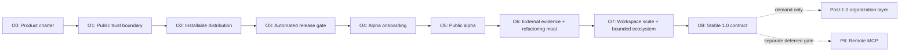

# Backend API Intelligence Open-Source Productization Implementation Plan

Status: active internal implementation plan; no phase starts automatically  
Planning baseline: 2026-09-08  
Prerequisite baseline: completed analysis Phases 0-47, verified wrapper Phases W0-W6,
platform Phases P0.1-P5.2, and 176 passing test files / 485 passing tests  
Explicitly deferred: Platform Milestone P6 remote MCP

This is the implementing agent's phased execution plan for evolving the private
`api-intel` repository into a trustworthy open-source developer product. It does not
authorize changing repository visibility, publishing packages or images, creating
external accounts, announcing a release, or granting credentials. Those actions need
an explicit user instruction in the applicable release phase.

The near-term objective is productization of the existing NestJS analysis wedge, not
new framework breadth. Except for correctness, security, compatibility, or a blocker
to clean distribution, new semantic extractors remain frozen through the first public
alpha.

---

## 1. Product positioning contract

### Primary positioning

> **Evidence-backed blast radius for legacy NestJS systems.**

### Proof claim

> **api-intel proves supported static paths to potential side-effect operations and
> reports exactly where proof stops.**

These statements are normative product requirements. Documentation, CLI messages,
release notes, examples, CI output, MCP descriptions, issue templates, and future
website copy must preserve them.

The headline is intentionally concise, but it must not appear as a completeness claim
without the proof claim or an immediately adjacent equivalent qualifier. In this
plan, “blast radius” always means the potential radius established by supported
static paths; it never means exhaustive runtime impact.

### Product model

```text
NestJS source
    -> versioned canonical evidence artifact
        -> understand: scan, endpoint trace, offline graph
        -> change: comparison and potential-impact analysis
        -> enforce: typed policies and CI gates
        -> assist: local read-only MCP queries
```

The canonical evidence artifact is the platform boundary. Every view consumes
validated facts; no adapter independently invents relationships.

### Allowed claims

- Deterministic for the same supported input, engine version, configuration, and
  dependency/type environment.
- Evidence-backed supported static paths to potential side-effect operations.
- Explicit ambiguity, unsupported constructs, external boundaries, and omitted-result
  counts.
- Local/offline analysis that does not import or start target application modules.
- Qualified potential blast radius, including explicitly conditional distributed
  paths where declared topology permits them.

### Prohibited or qualified claims

- Never claim complete or true runtime behavior, 100% coverage, guaranteed delivery,
  guaranteed side effects, or exhaustive impact.
- Never equate deterministic output with runtime correctness or completeness.
- Never describe zero supported-root reach as dead code.
- Never claim architecture degradation is prevented forever; policies cover only
  configured rules over available supported facts.
- Never claim broad backend, framework, ORM, broker, security, compliance, or audit
  certification without a separately verified contract.
- “Knip for backend architectures” may be used as a discovery analogy only when the
  NestJS scope and supported-static-path boundary are stated nearby. It is not the
  formal category or completeness promise.

### Initial users and primary job

Primary users are developers, consultants, and staff/platform engineers inheriting or
refactoring large NestJS systems that are difficult or unsafe to boot locally.

The primary job is:

> Before changing an endpoint, worker, service, or data-access path, show what the
> supported source can prove it may touch, what may be affected, the exact evidence,
> and the point at which proof becomes conditional or unavailable.

The retention workflow is `scan -> inspect -> refactor -> diff/impact/check -> CI`.
Graph visualization is a view within that workflow, not the product category.

---

## 2. Global implementation invariants

1. Local-first, offline-capable, and no telemetry by default.
2. Target source is parsed and type-checked but never imported, started, or evaluated.
3. Dynamic, ambiguous, unsupported, incomplete, and out-of-repository behavior remains
   visible; product polish may not hide gaps to improve apparent coverage.
4. Package semantic version, analysis schema versions, derived-document versions,
   configuration versions, provider adapter versions, and compatibility promises are
   independent and documented explicitly.
5. Canonical IDs, ordering, evidence containment, result states, and existing
   compatibility readers remain authoritative.
6. Runtime paths, credentials, secret values, package-manager configuration, and
   target payload values never enter canonical artifacts.
7. Redaction reduces accidental exposure but is not presented as a confidentiality
   guarantee. Generated artifacts can still describe private architecture.
8. Public install and contributor commands must pass from clean environments. A local
   workspace with existing dependencies is not release evidence.
9. Alpha support labels are evidence-based per surface and operating system. GitHub
   hosted validation does not validate GitLab; mock publisher validation does not
   validate hosted mutation.
10. Core analysis accuracy, official NestJS extractors, canonical schemas, local
    reports, and proof boundaries remain open. A future commercial layer may add team
    coordination but must not make open facts less trustworthy.
11. Target repositories and downloaded CI artifacts remain untrusted. Dynamic plugins
    or configuration supplied by a target cannot execute inside a privileged analyzer
    or publisher context.
12. No external publication, repository visibility change, registry push, tag,
    release, announcement, or credential mutation occurs without explicit user
    authorization and exact target verification.

---

## 3. Current release-readiness baseline

The engine is technically mature enough to prepare an alpha, but it is not currently
publishable as a supported package.

Known blockers to resolve in order:

1. `package.json` deliberately retains `private: true`; only O5.1 may derive the
   audited publishable manifest after all earlier release gates pass.
2. The runtime dependency defect is resolved: the compiler API, SQL/WASM parser,
   graph asset, validators, and MCP server are covered by a closed production ledger
   and pack verifier. Clean-room installation evidence still belongs to O2.3.
3. Apache-2.0, root license text, third-party notices, and a reproducible package/asset
   inventory are implemented, and scoped project-owner authorization is recorded;
   exact candidate provenance plus per-image OCI source-obligation review remain
   publication gates.
4. The package surface is now intentionally CLI-first: only the configuration and
   support-manifest JSON Schemas are exported, while package-root and deep `dist/`
   imports remain closed. There is no approved JavaScript/TypeScript library API.
5. The npm allowlist now contains runtime JavaScript, both schemas, package
   documentation, and legal evidence only. GitHub/GitLab bundles remain separate
   distributions with independently verified copied assets.
6. There is no generic clean-clone repository CI or automated release/supply-chain
   gate. The existing provider adapters are products of the repository, not a neutral
   bootstrap trust root for its own first public release.
7. Public community/security files, changelog, support policy, issue templates, DCO,
   and disclosure contracts are implemented; the private security and conduct channels
   remain inactive until the sanitized public repository is created.
8. Current docs are comprehensive references but the public front door is too large
   for a first successful scan. Some examples use repository-local development
   commands rather than an installed-package path.
9. The current scanner covers one TypeScript project/tsconfig per scan. Large Nest
   workspaces require explicit orchestration before a monorepo-wide claim is allowed.
10. GitLab hosted execution and P5.2 real provider comment mutation retain their
    existing deferred/mock-verified labels.

These are productization gaps, not evidence that the core analysis must be redesigned.

---

## 4. Phase and gate map



| Milestone                      | Complexity              | Feasibility                     | Activation rule                                  |
| ------------------------------ | ----------------------- | ------------------------------- | ------------------------------------------------ |
| O0 product charter             | Small-medium            | High                            | Start first                                      |
| O1 public trust boundary       | Medium                  | High with owner/legal decisions | O0 passed                                        |
| O2 installable distribution    | Medium-high             | High                            | O1 current-tree sanitation passed                |
| O3 automated release gate      | Medium-high             | High                            | O2 clean package candidate exists                |
| O4 onboarding                  | Medium                  | High                            | Installed commands are stable enough to document |
| O5 public alpha                | Medium operational risk | High after gates                | Explicit publication authorization               |
| O6 external validation/ratchet | High                    | High but adopter-dependent      | Alpha install path proven                        |
| O7 workspace scale/ecosystem   | High                    | Moderate-high                   | Demonstrated demand and benchmark baseline       |
| O8 stable 1.0                  | Medium-high             | High after external evidence    | O6/O7 adoption gates passed                      |

---

## 5. Milestone O0 — Product charter and public boundary

### Phase O0.1 — Freeze the positioning and claims ledger

Status: complete

Goal: turn the two approved positioning statements into an executable documentation
contract before public-facing files are rewritten.

Deliverables:

1. Add a concise product charter naming the primary user, problem, workflow, evidence
   model, non-goals, allowed claims, and prohibited claims.
2. Add documentation tests that prevent reintroduction of runtime-truth, exhaustive
   impact, or unqualified “100% accurate” claims.
3. Define standard terms for `proven`, `potential`, `conditional`, `ambiguous`,
   `unsupported`, `missing`, and `out_of_repository` across CLI/docs/reports.
4. Inventory existing public-facing text and record required claim corrections without
   rewriting historical ADRs or validation records.

Acceptance:

- The exact primary positioning and proof claim appear in the charter.
- Every prohibited claim has an approved replacement.
- Historical documents remain historical and cannot override the current claims
  ledger.
- No analyzer or schema behavior changes.

Completion note (2026-09-09): `docs/product-charter.md` now freezes the two approved
claims, user/job/evidence model, proof-stop terminology, replacement ledger, non-goals,
and a reviewed claim-surface inventory. The README carries both claims and replaces
the ambiguous “runtime-validated” phrase with “schema-validated”; the documentation
index separates product-claim authority from behavioral source authority. A focused
documentation contract test protects the charter, public current-doc surfaces,
generated-report claim emitters, and the historical/non-normative boundary. Analyzer
and schema behavior are unchanged.

Verification: all 49 documentation test files / 58 tests pass; targeted ESLint,
TypeScript typecheck, and Prettier checks pass. The full 177-file / 489-test concurrent
run completed 486 tests and timed out three TypeScript-heavy integration cases under
parallel load; both affected files then passed independently (5/5 tests), confirming
contention rather than a behavioral assertion failure.

### Phase O0.2 — Select public name, release surfaces, and support labels

Status: complete

Goal: prevent permanent package, schema-link, badge, and release churn.

Deliverables:

1. Audit repository name, CLI name, scoped npm package availability, domains, and
   obvious trademark conflicts. Keep `api-intel` provisional until the user selects
   the public identity.
2. Freeze alpha surface labels:
   - core alpha: CLI, canonical artifacts/readers, offline graph, and local stdio MCP;
   - hosted-validated preview: GitHub Action, reflecting its exact validated matrix;
   - locally verified preview: GitLab component/container;
   - mock-verified preview: P5.2 provider comment publishers.
3. Decide whether the first package is CLI-only or includes a small curated
   artifact-reader/query library. Do not expose every emitted `dist` module
   accidentally.
4. Define alpha/beta/stable channels and state that package semver is independent from
   document schema majors.
5. Freeze the initial Node, TypeScript, NestJS, TypeORM, package-manager, and
   operating-system claim matrix using only verified combinations.

Completion note (2026-09-09): `docs/public-release-boundary.md` selects the low-churn
formal name **Backend API Intelligence Engine**, category **Deterministic NestJS change
intelligence**, existing `api-intel`/`api-intel-mcp` bins, repository slug
`nestjs-api-intelligence-engine`, and first package candidate
`@fakrulauzaie/api-intel`. Both the scoped and unscoped npm names returned `E404` in a
read-only point-in-time registry check, but this phase reserves or publishes neither.
No domain is adopted. Apache-2.0 is the selected direction for the O1.1
legal/redistribution audit; O1.1 subsequently aligned the manifest and root license,
without treating that mechanical change as owner/legal publication approval.

The first package is CLI-first with no supported JavaScript/deep-import API. The
contract freezes eleven CLI commands, eight local MCP tools, independent version
domains, exact core/hosted/local/mock/deferred labels, and a deliberately narrow
compatibility matrix. A sanitized O1.2 prerequisite originally recorded an embedded
remote credential while the tracked tree contained no matching GitHub-token pattern.
The owner later rotated the credential and replaced the remote URL; a 2026-09-09
redacted audit confirmed no remote userinfo, no matching `.git/config` token pattern,
and no tracked token-pattern hits.

Verification: the complete documentation suite passes (50 files / 63 tests), including
the O0.1 claim lint and five O0.2 identity/surface contracts. Targeted ESLint,
TypeScript typecheck, Prettier, local-link validation, and the sanitized tracked-token
pattern check pass. No analyzer, schema, package manifest, external resource, license,
credential, or Git configuration changed.

Gate OG0 — Product identity:

1. One public name and package scope are owner-approved after availability review.
2. The two positioning claims and prohibited-claim ledger are approved.
3. Initial surfaces and their evidence-based support labels are explicit.
4. The public API commitment is finite and enumerable.
5. P6, hosted source upload, telemetry, and remote services remain out of scope.

Gate result (2026-09-09): passed. The user's instruction to proceed with O0.2 adopts
the selected internal release identity and Apache-2.0 audit direction. Availability is
not reservation; authenticated npm-scope ownership, legal clearance, and every
external mutation remain later gates. The public commitment is finite and enumerable,
and no package, domain, tag, badge, schema URL, or announcement was created.

Ordering hazard: do not publish package URLs, permanent schema URLs, badges, tags, or
announcements before OG0 passes.

---

## 6. Milestone O1 — Legal, privacy, and repository trust boundary

### Phase O1.1 — License and third-party redistribution audit

Status: project-owner authorization complete; release-specific third-party and OCI
review remains required before publication

Goal: make source and bundled artifacts legally distributable under an intentional
open-source license.

Deliverables:

1. Choose an OSI-approved license and copyright holder; ensure package metadata and the
   root license file agree. Apache-2.0 is the default candidate for explicit patent
   terms, but this plan does not provide legal advice.
2. Inventory direct/transitive package licenses plus copied/bundled Cytoscape and
   `libpg-query` assets.
3. Identify notice, attribution, source-offer, or redistribution obligations for npm,
   ncc action bundles, and OCI images.
4. Add the required notice/attribution material and a reproducible dependency-license
   report or SBOM input.
5. Verify that fixtures, screenshots, sample outputs, and borrowed official samples
   have documented provenance and compatible redistribution terms.

Acceptance:

- Root license text matches package metadata.
- Every redistributed binary/browser/WASM asset has traceable origin and obligations.
- License/notice files are included in every applicable distribution.
- Any unresolved ownership or incompatible asset blocks repository publication.

Completion note (2026-09-09): the project manifest and root license now agree on
Apache-2.0. `THIRD_PARTY_NOTICES.md`, a fixture/example provenance register, and a
release-surface redistribution audit document the applicable boundaries. The
deterministic license audit, refreshed for O3.1 on 2026-09-10, resolves the installed
pnpm graph into 228 reviewed package records (8 production and 220 development),
fingerprints the lockfile and all packaged
license/notice evidence, and separately fingerprints the copied Cytoscape browser and
libpg-query WASM assets. Its allowlist contains only the seven reviewed license
declarations and fails closed on drift. BlueOak-1.0.0 was admitted only after reviewing
the license and notice condition for five coverage-only transitive dependencies.

Both ncc builds now emit `THIRD_PARTY_LICENSES.txt` and copy the project license,
third-party notices, and dependency inventory into their indivisible distribution
directories. The GitLab Dockerfile labels the project source/license and carries those
files into the image. The OCI boundary remains deliberately conditional: exact base
digest, image SBOM, and any Debian/Git corresponding-source evidence must be retained
for each published image. Mechanical audit success is not legal advice or approval.

Owner authorization note (2026-09-10): the owner attested that this is a personal
project, holds the rights needed to license the independently authored project source,
and authorized that qualifying material for public release under Apache-2.0. The
authorization explicitly excludes organization-derived source, data, identifiers,
topology, screenshots, artifacts, and business details from systems permitted only as
private development targets. It also leaves all third-party and release-specific OCI
obligations intact. The machine-readable release policy fails closed if that scope is
weakened. This is an owner attestation, not an independent legal opinion, and it does
not itself authorize an external publication mutation.

### Phase O1.2 — Privacy, secrets, and public-tree sanitation

Status: complete; sanitized-new-repository strategy selected, execution deferred

Goal: prevent a public release from exposing client data, credentials, private paths,
or misleading internal artifacts.

Credential prerequisite cleared on 2026-09-09: the owner removed the embedded remote
credential and rotated it. A redacted local verification found a credential-free HTTPS
origin, no token pattern in `.git/config`, and no matching tracked-file hit. O1.2 must
still audit the complete current tree, release candidates, and repository history; this
check does not prove history sanitation.

Deliverables:

1. Scan the current tracked tree and proposed package/release contents for credentials,
   internal endpoints, personal paths, customer names, proprietary fixtures, and
   generated artifacts.
2. Audit repository history separately. If history contains material that should not
   become public, stop for an owner decision between a sanitized new public repository
   and an explicitly approved history-rewrite process.
3. Replace private examples with synthetic or permission-cleared fixtures while
   retaining equivalent positive/negative semantic coverage.
4. Add a privacy/threat guide explaining local processing, no telemetry, artifact
   sensitivity, snippets, architecture metadata, secret redaction limits, and safe
   support-bundle handling.
5. Ensure public docs do not embed local absolute paths or private registry/container
   coordinates.

Acceptance:

- Current tree and release candidate pass secret/private-material audits.
- Artifact confidentiality limitations are visible in the README and security docs.
- No history rewrite or destructive cleanup occurs without explicit authorization.
- Tests prove sanitized fixtures retain their semantic contracts.

Completion note (2026-09-10): the current Git candidate tree and exact npm dry-run
candidate are now covered by a fail-closed, value-redacting audit. It checks
high-confidence credential shapes, concrete user-home paths, sensitive filenames,
unexpected generated-output directories, and a reviewed set of organization-derived
text fingerprints. Synthetic adversarial values have exact path-scoped allowances;
findings never record the matched value. The current tree and npm candidate pass with
no findings.

Organization-derived service, broker, interaction, resource, class, source-path, and
job identifiers were replaced in the current tree with a project-authored synthetic
orders API/worker and order/workflow corpus. Its positive, negative, ambiguity,
open-world, critical-section, and must-not-infer contracts remain executable. Public
commands now use repository-relative paths, while MCP host configuration uses explicit
absolute-path placeholders. The README and privacy guide make local/no-telemetry
processing, artifact confidentiality, redaction limitations, CI/MCP boundaries, and
safe support handling visible.

The non-reproducible P4 mutation harness was removed: it depended on private sibling
repositories and edited target source in place. Repository-local system comparison and
impact tests retain the relevant engine contract without that publication risk.

The separate read-only audit of all 15 reachable commits reports 18 finding
categories/IDs. On 2026-09-10 the owner selected a sanitized new public repository with
fresh history. The legacy findings remain visible as `findings_detected`, but their
publication disposition is `excluded_by_selected_strategy`: this repository and its
history remain private, and no rewrite is performed. A staged source export, fresh Git
initialization, and external repository creation are deferred to O5.1/O5.2 after all
earlier gates. This phase does not authorize repository creation or publication.

### Phase O1.3 — Community, security, and maintenance contract

Status: implementation complete; operational private-channel activation remains an
O5.2 publication prerequisite

Goal: establish a support boundary before accepting public issues and contributions.

Deliverables:

1. Add `SECURITY.md`, `CONTRIBUTING.md`, `CODE_OF_CONDUCT.md`, changelog, support and
   compatibility policies, and minimal governance/maintainer ownership.
2. Add issue templates for bugs, false positive/negative reports, framework support,
   and feature proposals; add a pull-request template requiring semantic fixtures.
3. Define a private vulnerability-reporting path and response expectations that the
   maintainer can realistically support.
4. Define what artifacts may accompany issues and how users can produce a source-free,
   redacted diagnostic manifest.
5. Move or index internal phase plans so they remain historical implementation context
   rather than the public onboarding path.
6. Select and document the inbound contribution-license policy—such as
   inbound-equals-outbound with a DCO, or a separately reviewed CLA—before accepting
   public contributions.

Completion note (2026-09-10): the repository now has concise security, contribution,
conduct, support, compatibility, governance, maintainer, and changelog contracts.
Four structured issue forms and the pull-request template require synthetic evidence,
artifact-safety review, explicit proof boundaries, semantic close negatives, and
`mustNotInfer` coverage. Blank issues are disabled. Internal phase plans remain in
place but are classified through a historical, non-normative index rather than being
presented as onboarding documentation.

The selected contribution policy is Apache-2.0 inbound-equals-outbound with Developer
Certificate of Origin 1.1 sign-offs and no CLA. A repository-local checker verifies
the author and every co-author against exact `Signed-off-by` trailers; a least-
privilege `pull_request` workflow enforces it without a third-party Action. The future
public repository must make that status check required.

Support intake uses a strict source-free JSON manifest that permits only versions,
generic environment facts, aggregate counts, diagnostic codes, and explicit privacy
attestations. It excludes paths, revisions, source, snippets, identifiers, messages,
free text, and rich analysis artifacts.

GitHub Private Vulnerability Reporting is the selected security path, but it cannot be
activated before the public repository exists. A separate private conduct contact is
also not yet configured. Public issue/PR/discussion intake therefore remains disabled;
O5.2 must activate and test both private channels before participation. Response
timings are best-effort targets, not an SLA. No external repository, channel, account,
or publication was created by this phase.

Gate OT0 — Public trust:

1. Project-owned material has owner authorization; third-party obligations and each
   release-specific OCI input pass their applicable review.
2. Current tree is sanitized and the selected fresh-history repository strategy is
   enforced; the eventual staged public tree must pass its own release audit.
3. Security, privacy, contribution, conduct, support, and change policies exist.
4. Fixtures and examples have redistribution provenance.
5. The contributor-license policy is owner-approved and mechanically enforced where
   applicable.
6. No public-release action has occurred.

Gate state after the 2026-09-10 owner attestation: project-owner/IP authorization is
complete and its organization-material exclusion is machine-recorded. OT0 remains open
for the exact staged-public-tree and distribution-candidate audits, release-specific
third-party/OCI review, and operational activation of both private reporting channels;
policy files alone do not prove those external controls exist.

---

## 7. Milestone O2 — Installable distribution and curated API

### Phase O2.1 — Correct package runtime and manifest

Status: complete

Goal: make the ordinary installed CLI self-sufficient rather than relying on a
developer checkout or ncc side effects.

Deliverables:

1. Move every actually imported runtime dependency, including the engine's TypeScript
   compiler dependency, into the correct dependency class or deliberately bundle it.
2. Keep `private: true` as a source-tree publication guard throughout O2-O4. Build the
   publishable manifest only in the audited staged release tree during O5.1; do not
   weaken the source-tree guard merely to run `npm pack` or clean-room tests.
3. Add approved package name, description, repository, homepage, bugs, funding if
   applicable, maintainers, license, keywords, engines, and package-manager metadata.
4. Preserve both reviewed bins with executable shebangs and platform-safe paths.
5. Add deterministic `prepack`/pack verification that cannot publish stale build output.
6. Decide lifecycle-script policy. Installation must not require building native code
   or executing target-project scripts unexpectedly.

Acceptance:

- Production dependency analysis finds no undeclared runtime import.
- Installed `api-intel` and `api-intel-mcp` do not depend on the source tree.
- Consumer installation does not require pnpm merely because contributors use pnpm.
- Stable manifest metadata is complete and matches the selected public
  identity/license. Destination-derived URLs remain absent until the sanitized public
  repository exists; placeholders do not satisfy this criterion.

Completion note (2026-09-10): the private source manifest now uses the selected
`@fakrulauzaie/api-intel` identity, owner/maintainer handle, evidence-backed
description, expanded keywords, Apache-2.0 license, Node range, package-manager record,
and both reviewed bins. `private: true` remains enforced. Repository, homepage, and
bugs URLs are intentionally absent because no sanitized public repository exists;
funding is not applicable. O5.1 owns their exact staged values, while O2.2 still owns
the final public import surface.

TypeScript 5.9.3 moved from development-only to an exact production dependency because
the scanner imports its compiler API at runtime. The checked runtime contract covers
all five direct dependencies, including the computed Cytoscape asset resolution that
ordinary import scanning cannot discover. Its verifier rejects dependency drift,
undeclared emitted imports, relative imports escaping `dist`, missing/stale compiler
outputs, version mismatch, missing bin shebangs, destination metadata added too early,
and consumer install hooks anywhere in the installed production closure.

`prepack` uses npm—not pnpm—to build and verify, so packing does not depend on the
contributor package manager. The retained run rebuilt 256 source modules into exactly
1,024 expected emitted files, found four statically imported third-party packages plus
the declared dynamic Cytoscape asset, walked eight production packages, and found zero
`preinstall`, `install`, or `postinstall` hooks. Both CLI and MCP version/help paths ran
from `dist`. This is source-workspace runtime evidence; O2.3 remains responsible for
isolated npm and pnpm consumer installation.

### Phase O2.2 — Curate package exports, schemas, assets, and size

Status: complete

Goal: publish an intentional surface instead of treating all emitted declarations and
provider bundles as stable APIs.

Deliverables:

1. Add a finite export map only for surfaces approved by OG0. Because OG0 selects a
   CLI-first alpha, do not publish declaration entrypoints until a JavaScript/TypeScript
   library API is deliberately designed.
2. Publish the CLI/MCP bins, configuration JSON Schema, licenses/notices, concise
   package documentation, and only the WASM/browser assets that are not already
   reliably resolved through declared runtime dependencies.
3. Ensure public examples import only package exports—never `src/` or undocumented
   `dist/` paths.
4. Exclude tests, private plans, temporary outputs, source maps if not intentionally
   public, and duplicate GitHub/GitLab bundle payloads from the ordinary npm tarball.
5. Keep GitHub Action and OCI/GitLab distributions separately reproducible. Defer a
   multi-package workspace until measured size/API demand justifies it.
6. Establish tarball compressed/unpacked size and file-count budgets, recording
   justified exceptions for the SQL parser or offline graph assets.
7. Maintain a distribution-specific asset manifest so each required asset is shipped
   exactly once per npm, ncc, or OCI distribution unless duplication is demonstrated
   to be technically necessary.

Acceptance:

- Every exported data path is documented and covered by an import smoke test; no
  symbol export is implied by CLI internals.
- No supported example uses a deep import.
- `$schema` guidance resolves to a file actually shipped in the package.
- Exact tarball contents and size pass a checked-in allowlist/budget.
- Clean-pack execution, rather than assumptions from development resolution, proves
  which colocated assets the npm tarball actually needs.

Completion note (2026-09-10): OG0's CLI-first boundary was applied literally. The
package exports only its two shipped JSON Schemas and exposes the existing `api-intel`
and `api-intel-mcp` bins; it has no package-root JavaScript entrypoint or declaration
surface. Package self-resolution smoke tests cover both data exports and prove that
root/deep imports remain blocked. Public examples contain no package `src/` or `dist/`
import.

The real npm pack audit retains every file path, size, SHA-256, archive shasum and
integrity. After the O4.1 archive refresh, the candidate contains 269 files (261
runtime JavaScript modules plus eight metadata/schema/legal files), 436,975 packed
bytes, and 2,361,241 unpacked bytes,
within budgets of 280 files, 650,000 packed bytes, and 3,000,000 unpacked bytes.
Declarations, source maps, tests, source, scripts, templates, private plans, and the
GitHub/GitLab bundles are excluded.

Cytoscape and libpg-query WASM are not copied into npm because exact runtime
dependencies own and resolve them. The distribution contract verifies the source
hashes and exactly one copy in each separately reproducible GitHub Action and GitLab
bundle. This proves tarball contents from the source workspace; isolated consumer
installation and runtime asset resolution are proven separately by Phase O2.3.

### Phase O2.3 — Clean-room installation gate

Status: complete

Goal: prove the audited package rather than the repository workspace.

Deliverables:

1. Build and audit the package in the source workspace, then create the exact reviewed
   archive in a validated operating-system temporary directory. A clean source checkout
   is deliberately reserved for Phase O3.1 rather than conflated with consumer isolation.
2. Install the tarball in isolated npm and pnpm consumer fixtures without access to the
   repository's `node_modules`.
3. Run `--version`, `--help`, MCP startup/protocol smoke, public API imports, config
   validation, a static fixture scan, raw-SQL parser path, and offline graph generation.
4. Verify no preview/browser process is needed for automated graph tests.
5. Test missing target dependencies and invalid tsconfig through actionable,
   non-stack-dump diagnostics.
6. Verify packed bytes/hashes can be compared with the eventual registry candidate.

Gate OD0 — Distribution:

1. Clean npm and pnpm installs pass without workspace leakage.
2. Every documented bin/export/schema and runtime asset works.
3. No undeclared dependency, missing file, unexpected install script, or absolute local
   path remains.
4. Tarball allowlist and size budgets pass.
5. Installed output retains all existing static-analysis honesty boundaries.

Ordering hazard: do not write the final public quick start until OD0 establishes the
actual installed command and package name.

Completion note (2026-09-10): the clean-package-consumer gate installed the exact
269-file O2.2/O4.1 archive into separate npm and pnpm projects under an operating-system
temporary directory. The retained Windows x64 run used Node.js 22.13.1, npm 10.9.2,
and pnpm 11.21.0. Every installed file matched the reviewed size and SHA-256 ledger;
the archive is now 436,975 packed bytes and 2,361,241 unpacked bytes with SHA-1
`3aa89e2bab3ddf9aa5743181618478b9c5a82bf7`. Runtime dependency resolution stayed
inside the temporary tree, install scripts were disabled, and the source workspace's
`node_modules` was not used.

Both consumers ran the two local bin shims, imported both data-only schema exports,
kept root/deep imports blocked, completed the frozen `POST /orders` scan, resolved the
libpg-query WASM path, proved the expected `order_record` read, and generated the same
self-contained graph without browser preview. The installed MCP server completed
initialize and exposed exactly the eight approved tools. The missing-dependency case
honestly completed with `TS_IMPORT_UNRESOLVED`; malformed tsconfig exited 2; neither
negative emitted a stack trace. The report contains no temporary or workspace path.

Gate OD0 passes for this exact environment. The verifier and frozen contract make the
archive, bins, schemas, runtime assets, static-analysis honesty cases, package budgets,
and future registry-byte comparison executable. This is not a clean-source or broad
compatibility claim; O3.1 still owns those matrices.

---

## 8. Milestone O3 — Automated quality and supply-chain release gate

### Phase O3.1 — Neutral repository CI

Status: implementation complete; hosted matrix validation pending

Goal: validate clean source independently of api-intel's own packaged provider
adapters.

Deliverables:

1. Add ordinary repository CI for install, formatting, lint, strict typecheck, full
   tests, production build, documentation contracts, and config-schema drift.
2. Validate Node 22 and 24 on Linux and Windows. Add macOS only when its packaged path
   has passed and can be maintained; otherwise document it as unverified.
3. Run a pinned compatibility corpus for every publicly claimed TypeScript, NestJS,
   TypeORM, and package-manager combination, or narrow the public support matrix to
   the combinations actually verified. Fake declaration fixtures prove extractor
   semantics, not real framework-version compatibility.
4. Constrain dependency lifecycle scripts and credentials according to the existing CI
   trust model.
5. Add cancellation, time, memory, and artifact-retention settings suitable for the
   slower semantic corpus.
6. Measure coverage before choosing any threshold; do not replace semantic/golden
   assertions with line-count gaming.

Acceptance:

- A clean clone passes the maintained matrix.
- The existing 176-file/485-test baseline is retained or intentionally increased.
- OS/runtime support claims exactly match green matrix entries.
- Framework/compiler support claims exactly match pinned real-package compatibility
  entries; undeclared combinations remain unverified.
- The generic CI gate does not recursively depend on the product action it is trying
  to build.

Implementation note (2026-09-10): the ordinary read-only workflow, four-cell candidate
matrix, exact action pins, lifecycle constraints, resource bounds, configuration-schema
drift check, and real-package compatibility corpus are implemented. A local Windows
x64 / Node.js 22.13.1 run passed 187 test files and 521 tests. Its threshold-free V8
observation measured 88.67% statements/lines, 81.80% branches, and 95.08% functions
over `src/**/*.ts`. The exact environment and counts are retained in
`docs/benchmarks/phase-o3-1-coverage.md`.

The phase acceptance gate remains open: no sanitized public repository exists yet, so
the Linux/Windows Node 22/24 GitHub-hosted matrix has not run from a clean hosted clone.
The workflow declaration and local Windows evidence do not convert those candidate
cells into verified support claims. macOS remains intentionally unverified.

### Phase O3.2 — Reproducible provider and package artifacts

Status: implementation complete; hosted artifact and container validation pending

Goal: catch stale or incomplete checked-in/release distributions.

Deliverables:

1. Rebuild GitHub and GitLab ncc bundles and fail on unexplained drift.
2. Verify all ncc chunks, `libpg-query.wasm`, Cytoscape assets, fingerprints, action
   metadata, Dockerfile inputs, and component templates.
3. Run OD0 tarball smoke tests in CI and produce a canonical package manifest.
4. Run the GitHub action against a controlled fixture without using candidate code as
   the action implementation.
5. Run the OCI image unprivileged; either fix UID 0 or retain it as an explicit risk
   that blocks recommending the image publicly.
6. Preserve GitLab-hosted and real comment-mutation validation as independent support
   claims rather than fabricating equivalence from local tests.
7. Exercise the self-contained offline graph in every browser claimed for alpha:
   loading without network access, Cytoscape rendering, selection/filter/fit controls,
   keyboard and accessible-table fallback, and CSP behavior. Use automated browser
   smoke where stable and retain a documented manual gate for interactions that cannot
   yet be automated reliably.

Implementation note (2026-09-10): GitHub and GitLab builds now share one guarded ncc
recipe and support independent temporary output. The O3.2 verifier rebuilds both,
compares every file byte for byte, verifies copied WASM/Cytoscape/legal assets and
provider metadata, and checks a canonical distribution/npm ledger. A frozen controlled
target executes the checked `action-dist` through a complete successful comparison;
the target does not contain candidate action code. Clean-room smoke mode exercises OD0
without rewriting the retained platform-specific report. The GitLab image now defaults
to UID/GID `10001:10001`, and the hosted artifact lane declares runtime UID and bundled-
entrypoint checks.

Local Windows verification passed exact provider regeneration and the controlled
Action smoke. The GitHub-hosted artifact/container lane has not run yet. GitLab-hosted
component execution and real comment mutation remain separate deferred claims. O3.2
intentionally names no browser support matrix: deterministic offline/CSP/accessibility
contracts and the retained browser-unspecified manual pass do not justify one.

### Phase O3.3 — Release integrity and dependency policy

Status: implementation complete; Gate OR0 independent hosted/public-release validation pending

Goal: make a future published version traceable to reviewed source and audited bytes.

Deliverables:

1. Add dependency vulnerability and license checks with an explicit triage/exception
   record; fail unreviewed high/critical findings.
2. Produce checksums, an SBOM, source revision, toolchain versions, and build manifests
   for release candidates.
3. Define protected release environment, least-privilege registry identities, trusted
   publishing/provenance where supported, and token-free pull-request jobs.
4. Define tag/version/changelog consistency, rollback/yank procedure, and response to a
   compromised release.
5. Add a dry-run release that cannot publish externally.

Gate OR0 — Release candidate integrity:

1. Clean-clone CI, package smoke, provider bundle drift, and image smoke pass.
2. Candidate bytes are content-addressed and traceable to source/toolchain inputs.
3. Redistribution obligations are satisfied and no high/critical vulnerability is
   unreviewed. Any accepted exception records an owner, rationale, affected surface,
   compensating control, and expiry/review date.
4. Release credentials are unavailable to candidate code.
5. Dry-run release proves the pipeline without creating external state.

Completion note (2026-09-11): the release-integrity policy now binds an offline,
lockfile/policy/exception-hashed vulnerability decision to a separately explicit live
pnpm advisory refresh. The critical Vitest and high transitive `js-yaml` findings were
remediated with patched versions; the retained report has zero findings and the
exception ledger is empty. A deterministic CycloneDX source/build/runtime-dependency
SBOM, release-input manifest, and SHA-256 ledger cover the reviewed package/provider,
legal, policy, and toolchain inputs. The non-publishing dry run assembles the exact npm
archive and checked provider directories beneath guarded `.tmp`, records source
revision/tree fingerprint and actual tool versions, content-addresses every candidate
file, and always reports `publishable: false`; it has no registry/release mutation or
credential path. The CI release-artifact lane retains read-only permissions, compares
live advisories, runs the dry run, and uploads its evidence. Protected environment,
short-lived registry identities, tag/version/changelog requirements, immutable-byte
policy, rollback/yank handling, and compromised-release response are documented but no
publishing workflow exists.

Gate OR0 is not marked passed. The future sanitized public-repository clean-clone
matrix, GitHub-hosted provider/container run, deferred GitLab-hosted component run,
exact OCI base/image SBOM and source-obligation review, activated private security
channel, clean tagged source, and O5 publication authorization remain independent
requirements.

Verification: the live registry refresh and retained offline check report zero findings
at every severity through 2026-09-25; the license inventory covers 189 installed
packages with no unresolved license; npm package and refreshed npm/pnpm clean-room
evidence pass for 269 files, 436,975 packed bytes, and 2,361,241 unpacked bytes; 33
direct evidence inputs plus their generated manifest produce 34 source checksum
entries; provider distributions rebuilt and compared byte
for byte; and the dry run assembled 40 files (including its checksum ledger) while
recording eight expected publication blockers. Prettier, ESLint, TypeScript typecheck,
production build/runtime verification, and the full 191-file / 537-test suite pass on
the local Windows/Node 22.13.1 host. The frozen critical-advisory negative case also
proves that an unreviewed blocking finding fails the dependency gate.

---

## 9. Milestone O4 — Alpha onboarding and contributor experience

### Phase O4.1 — `doctor` and capability preflight

Status: complete

Goal: make environmental and coverage limitations actionable before a long scan.

Deliverables:

1. Add a read-only-by-default `api-intel doctor [repository]` command that resolves repository
   root, tsconfig, TypeScript program inputs, installed framework/type declarations,
   supported versions, configuration, best-effort output-path permission status, and
   required runtime assets.
2. Report each check as pass/warning/failure with stable codes and remediation text.
3. Publish an explicit capability summary: supported/enabled extractors, recognized
   frameworks, configuration bounds, and expected unavailable families.
4. Do not infer support from package names alone and do not run package installation.
5. Make the output safe for issue reports without including environment values,
   credentials, or absolute private paths by default.
6. If reliable writability proof is needed, expose a separately explicit
   `--probe-output` mode that performs only a bounded temporary create/delete probe in
   the resolved output directory and reports any cleanup failure. Do not describe a
   metadata-only check as proof of a future write.

Acceptance:

- Common missing-dependency, wrong-tsconfig, unsupported-version, and resolution
  failures become actionable before scanning.
- `doctor` is deterministic for the same filesystem/tool/config state and performs no
  target execution or network access.

Completion note (2026-09-11): `api-intel doctor [repository]` now defaults to the
current directory and emits either bounded human text or strict, canonical JSON at
doctor schema `1.0.0`. Its finite check-code model distinguishes pass, warning, and
failure for the declared Node range, packaged runtime assets, strict project
configuration, safe source inventory, TypeScript program construction, unresolved
imports, structural/semantic diagnostics, exact compatibility evidence, NestJS
declaration recognition, and output-path readiness. The capability summary separates
extractors that execute from TypeScript-resolved framework declarations, effective
configuration bounds, and expected unavailable families. A package manifest entry or
installed-but-unreferenced declaration cannot establish framework recognition.

Default output inspection remains metadata-only and labels create/delete proof false.
The explicit `--probe-output` branch creates one exclusive temporary file, flushes and
removes it, and removes only directory components created by that invocation; cleanup
failure is independently blocking. All normal output replaces the checkout root with
`<repository>`, keeps only safe relative paths or `<external-path>`, excludes compiler
messages and environment values, and is suitable for source-free issue intake after
human review. The implementation imports no installer, network client, or target
module, and the deterministic test repeats an unchanged preflight byte for byte.

Verification: focused command/documentation contracts pass for exact and unverified
framework versions, missing declarations, missing tsconfig, malformed configuration,
installed-but-unused packages, no target evaluation, output-probe cleanup, optional
repository syntax, and invalid options. The built CLI preflighted the pinned
`example-nestjs-app` with all six engine assets and four exact compatibility packages
resolved. Refreshed isolated npm 10.9.2 and pnpm 11.21.0 consumers both ran the packed
doctor command at schema `1.0.0`, proved runtime assets and TypeScript-resolved Nest
declarations, and exposed no absolute consumer path. Prettier, ESLint, strict
TypeScript, production build/runtime verification, package/provider integrity, and the
full 191-file / 537-test suite pass on Windows x64 / Node.js 22.13.1. Phase O4.1 makes
no new broad framework, operating-system, or hosted compatibility claim.

### Phase O4.2 — Deterministic initialization and first-use workflow

Status: complete

Goal: reach the first useful evidence-backed trace with minimal configuration.

Deliverables:

1. Design `api-intel init` as an explicit write command that previews or reports the
   exact file it will create and refuses destructive overwrite by default.
2. Generate only a minimal strict configuration based on proven repository facts;
   unresolved choices are reported in stdout and the companion guide rather than as
   invalid comments inside `api-intel.config.json`.
3. Make `api-intel scan . --with-graph --open` or its final installed equivalent the
   golden interactive path, with a non-GUI variant for CI/headless systems.
4. Add a short guided workflow for scan, endpoint trace, graph, pre/post refactor
   comparison, impact, and policy check.
5. Explain proof gaps prominently instead of presenting only successful detections.

Completed on 2026-09-12.

Implementation: added `api-intel init [repository] [--tsconfig <path>] [--write]
[--format text|json]` and initialization document schema `1.0.0`. Initialization runs
the configuration-disabled O4.1 preflight and requires TypeScript-resolved
`@nestjs/common` declarations. Default invocation is a byte-stable, source-safe
preview. The only candidate content is the strict current configuration
`{"version":4}` rendered canonically; `$schema`, raw-SQL dialect, authorization,
interaction limits, policies, reports, and output paths remain uninferred. Failure and
warning check codes are retained in the result, while absolute repository paths and
compiler messages are excluded.

Writing requires explicit `--write`. The implementation stages the complete small
file beside its fixed repository-root destination, syncs it, then uses an exclusive
same-volume link so the destination is never partially published or replaced. There
is deliberately no force/overwrite mode. An existing file or concurrent creator is
left untouched and returns the existing-configuration result with exit code 9;
preflight failures or unproven NestJS declarations return exit code 6 without a
write.

Documentation: added the short evidence-first workflow for doctor, preview/write,
interactive and headless graph scans, exact endpoint trace, before/after comparison,
potential impact, and explicit policy adoption. Proof gaps, diagnostics,
`completed_with_gaps`, conditional distributed paths, and the absence-of-evidence
boundary are presented as required interpretation rather than footnotes. The CLI,
configuration, README, changelog, documentation index, and alpha public-surface
contract now expose thirteen finite CLI commands; this records the intentional O4.2
surface update.

Verification: focused tests prove deterministic preview, no default write, exclusive
creation, no overwrite, NestJS-proof refusal, stable source-safe JSON, option
validation, browser-preview handoff, headless generation, endpoint catalogue, and
endpoint trace. The refreshed exact npm archive contains 271 files (263 runtime
JavaScript modules), is 440,316 bytes packed and 2,375,923 bytes unpacked, with SHA-1
`257a712ccb3054afb37f611e7a7f59ecdca2491a`; it remains under all reviewed budgets.
Isolated npm 10.9.2 and pnpm 11.21.0 consumers on Windows x64 / Node.js 22.13.1 both
ran installed init preview/write/no-overwrite and the headless first-use graph path
without source-workspace resolution. The final full suite passes 193 test files and
544 tests, alongside formatting, lint, strict typecheck, build, configuration-schema,
package-runtime/content, clean-room-report, provider-rebuild, and 34-input release-
integrity checks. No registry publication, real browser launch,
new framework-version claim, or hosted compatibility claim is made by this phase.

### Phase O4.3 — Public documentation and contribution fixtures

Status: implementation complete; final OX0 clean-candidate and browser evidence remains an O5.1 gate

Goal: separate a concise public front door from deep reference and historical records.

Deliverables:

1. Rewrite the README around the positioning, one installed command, one
   provenance-tracked product visual, the refactoring workflow, supported facts,
   proof stops, privacy, and links to deeper references. Use a real screenshot only
   when it can be captured from project-owned material through an allowed local
   browser path; otherwise use a clearly labeled fixture-derived illustration and do
   not manufacture browser-validation evidence.
2. Publish a compatibility/support table and a concise current limitations ledger.
3. Provide one small application and one realistic synthetic legacy system with
   stable expected artifacts and a documented refactoring story.
4. Document how contributors add positive, close-negative, diagnostic, evidence,
   compatibility, and performance fixtures before changing semantic extraction.
5. Validate every command/link/schema reference in documentation tests.
6. Provide minimal reproducible issue/support-bundle instructions that do not require
   sharing source code.

Gate OX0 — Onboarding:

1. A user without repository context can copy/paste from installation to a useful
   trace/graph in the maintained clean fixture.
2. First-use docs use only packed public surfaces.
3. Positioning and proof-stop language appear before advanced feature claims.
4. Contributor setup passes from a clean clone.
5. All commands, links, schemas, screenshots, and support labels are verified.
6. The offline graph passes its claimed browser/offline/interactivity/accessibility
   smoke matrix; unsupported browsers remain explicitly unclaimed.

O4.3 implementation note (2026-09-12): the root README is now a 205-line public front
door with the approved positioning/proof-stop language before capabilities, one
installed golden command, a refactoring loop, exact surface labels, privacy guidance,
and links into the deep reference set. A project-authored SVG derived from the
synthetic Notes path replaces the proposed screenshot because the available browser
security policy rejected local `file:` navigation; the restriction was not bypassed,
and the asset is explicitly not presented as browser evidence. The compatibility
guide now publishes the concise exact-environment table, while
`current-limitations.md`, `contributor-fixtures.md`, and `minimal-reproduction.md`
separate limitations, semantic fixture requirements, and source-free support intake.
The maintained example application has project-specific instructions with upstream
starter branding removed. The public synthetic legacy walkthrough and
`expected-summary.json` are mechanically bound to the frozen system-stitching
manifest instead of duplicating a new extractor corpus. Documentation Gate D1 now
checks all thirteen CLI synopses; Phase O4.3 tests verify positioning order, README
size, provenance, exact support labels, schema export references, fixture taxonomy,
installed-command usage, and the public expectation projection. Existing phase tests
now point to their detailed guides instead of requiring milestone prose in the public
README. Repository-local documentation evidence passes. O5.1 must still run the full
OX0 workflow from the exact clean staged candidate and retain any claimed browser
smoke; no named-browser or public-registry claim is added here.
Final repository-local verification passed formatting, lint, strict typecheck, build,
configuration-schema drift, the exact real-package compatibility corpus, 194 test
files/549 tests, and the 820-file current-tree plus 271-file npm-candidate sanitation
audit. The regenerated archive is 431,870 packed bytes and 2,351,876 unpacked bytes;
its isolated npm 10.9.2 and pnpm 11.21.0 report passes on Windows x64/Node.js 22.13.1.
Provider distributions reproduce byte-for-byte and the release ledger verifies 34
content-addressed inputs.

---

## 10. Milestone O5 — Public alpha

### Phase O5.1 — Audited alpha release candidate

Status: implementation complete; non-publishing candidate frozen, external publication remains O5.2-only

Goal: freeze exact source and bytes without publishing them.

Deliverables:

1. Pin one approved private source revision and export an allowlisted tree without its
   `.git` directory or organization-derived material into a separate candidate
   directory; audit that exact tree before initializing fresh public history.
2. Select a prerelease version only after the public name and semver policy are fixed.
3. Run OT0, OD0, OR0, and OX0 against one source revision.
4. Freeze tarball, checksums, SBOM, notices, release notes, compatibility table,
   limitations, migration notes, and rollback procedure.
5. Verify GitHub Action commit pins and OCI manifest-digest instructions without using
   mutable tags in supported examples.
6. Record which surfaces are core alpha, hosted-validated preview, locally verified
   preview, and mock-verified preview.
7. Generate the publishable package manifest only in the staged candidate, omitting
   the source-tree `private` guard there after all earlier gates pass. Retain the guard
   in the working repository unless a separate owner decision removes it.
8. Verify the community files, issue forms, DCO workflow, source-free diagnostic
   manifest, and inactive-to-active channel wording in the staged repository.

Acceptance:

- The audited candidate is immutable and reproducible.
- No release note overstates runtime truth, framework breadth, or provider validation.
- A disposable local/CI install uses only candidate artifacts.
- The candidate contains only owner-authorized project material and reviewed third-
  party redistribution inputs; private target-testing permission is never treated as
  publication permission.

Completion note (2026-09-12): `0.1.0-alpha.1` is the selected first prerelease
candidate under the already-fixed `@fakrulauzaie/api-intel` identity. The private
workspace retains `private: true`. A new strict staging contract and non-publishing
exporter inventory the tracked plus non-ignored working tree, reject non-allowlisted
roots, generated/dependency/history segments and symbolic links, export only regular
files without `.git`, and remove only the staged package manifest's `private`
property. The private Git HEAD is retained as ancestry evidence, while complete
private/staged per-file fingerprints provide the exact content revision even though
the accumulated implementation tree is not represented by HEAD alone.

The separate content-addressed candidate freezes the sanitized source, two
independently reproduced npm-pack bytes, exact disposable-install smoke, SHA-256
ledger, CycloneDX dependency SBOM, notices, release notes, compatibility and
limitations tables, migration guidance, and rollback/compromise procedure. GitHub
consumer references are constrained to full commit SHAs (with an explicit unresolved
candidate placeholder before public history); GitLab consumers require a full
component commit SHA and OCI manifest digest. Surface labels remain core-alpha,
hosted-validated preview, locally verified preview, mock-verified preview, or deferred
according to their actual evidence.

Candidate-level OT0, OD0, OR0, and OX0 checks pass without external mutation. The
manifest continues to list the clean public-repository hosted matrix, exact OCI
SBOM/base/image obligation review, GitLab-hosted component execution, active private
security/conduct channels, and any future named-browser claim as independent pending
gates. O5.1 creates no repository, registry object, image, tag, release, issue channel,
or publication workflow; only separately authorized O5.2 may do so.

### Phase O5.2 — External publication

Status: pending; requires explicit user authorization at execution time

Goal: publish only the exact O5.1 candidate to approved destinations.

Authorized deliverables after explicit approval:

1. Create the sanitized public repository from the audited O5.1 staging tree with
   fresh history; do not change the private source repository's visibility or mirror
   its refs.
2. Before accepting issues or pull requests, publish and test a private conduct
   contact, enable GitHub Private Vulnerability Reporting, require the DCO check, and
   update only the pre-publication channel-status wording reviewed in O5.1.
3. Publish the audited prerelease under the owner-approved package name and identity.
4. Create the immutable source tag/release and attach checksums/SBOM/notices.
5. Publish the GitHub Action reference and digest-pinned OCI image only for surfaces
   whose individual release gates passed.
6. Avoid broad launch claims; invite alpha users around the legacy NestJS refactoring
   job and explicit limitations.

Safety boundary:

- Before each external mutation, resolve and report the exact repository, organization,
  package, version, registry, tag, visibility, and credential scope.
- Never overwrite an existing package version or mutable release artifact.
- GitLab-hosted validation and P5.2 hosted publisher mutation are not implied by core
  alpha publication.

### Phase O5.3 — Published-artifact verification and rollback drill

Status: pending

Goal: test what users actually receive.

Deliverables:

1. Install the exact registry package on fresh maintained OS/Node combinations.
2. Compare registry tarball bytes to the audited O5.1 candidate.
3. Run CLI, local MCP, public API, fixture scan, SQL/WASM, and offline graph smokes.
4. Run the published action against a disposable pull request and the image as an
   unprivileged container where claimed.
5. Verify the published Action commit/bundle fingerprint and OCI manifest digest,
   attached SBOM/provenance, and configuration metadata against the corresponding
   immutable O5.1 distribution manifests—not merely by observing that they run.
6. Verify documentation links, issue/security routes, and package metadata.
7. Exercise rollback/yank instructions without removing a valid release unless the
   user explicitly authorizes it.

Gate OA0 — Public alpha:

1. Installed npm, Action, and OCI bytes/digests match their audited candidates for
   every published surface.
2. Maintained platform smoke tests pass.
3. Public limitations and support labels are accurate.
4. Security/reporting and rollback routes work.
5. Any failed surface is relabeled or withheld rather than inferred working.

---

## 11. Milestone O6 — External evidence and the refactoring moat

### Phase O6.1 — Design-partner protocol and evaluation corpus

Status: pending; requires user-provided participants and explicit repository permission

Goal: validate usefulness and proof quality beyond project-authored fixtures.

Deliverables:

1. Recruit approximately three to five unrelated legacy NestJS repositories or
   design partners under explicit access, confidentiality, and retention terms.
2. Define human-review protocol for supported true/false edges, missing supported
   paths, expected gaps, environment setup, and refactoring outcomes.
3. Keep private source outside the public corpus unless separately licensed; publish
   only consented, sanitized cases and aggregate metrics.
4. Freeze framework/version/topology metadata so results are reproducible.
5. Record false positive, false negative, ambiguous, unsupported, and setup-failure
   categories separately.
6. Schedule at least one consented upgrade trial between alpha builds and one bounded
   contributor-flow trial, recording migration friction and whether the contribution
   can be reproduced without access to private source.

### Phase O6.2 — Correctness, performance, and adoption baseline

Status: pending

Goal: replace intuition and marketing claims with measured evidence.

Metrics:

- time to first successful scan and first useful trace;
- supported-pattern precision and reviewed supported false negatives;
- explicit gap/ambiguity rates by framework pattern;
- scan wall time and peak memory against source-file/LOC/method counts;
- graph/report load and query latency under existing bounds;
- setup failure and remediation success rate;
- real refactors where a supported effect or blast-radius path changed a decision;
- upgrade-induced semantic diffs distinguished from source-induced diffs.
- clean-upgrade success and contributor time-to-reproduce/time-to-green.

Deliverables:

1. Add benchmark fixtures and versioned result records without turning synthetic
   numbers into external-repository claims.
2. Define regression budgets only after measuring representative baselines.
3. Prioritize correctness, diagnostics, setup, and performance fixes over new feature
   families.
4. Publish an honest limitations ledger and selected consented case studies.

### Phase O6.3 — Architecture-debt ratchet

Status: pending

Goal: let legacy systems prevent new regressions without pretending existing debt can
be fixed immediately.

Deliverables:

1. Design a strict baseline contract over policy subjects/outcomes and exact analysis/
   configuration provenance.
2. Add fail-on-new-or-regressed policy semantics while retaining existing failures as
   visible debt rather than passing facts.
3. Distinguish fixed, unchanged, new, worsened, unknown, and incompatible-baseline
   states with deterministic ordering and process outcomes.
4. Reuse canonical comparison/policy primitives; do not infer changes from filenames
   or branch state.
5. Keep missing/incompatible baselines separate from an empty clean baseline.

### Phase O6.4 — Bounded suppressions and exception lifecycle

Status: pending

Goal: make necessary exceptions reviewable instead of teaching users to disable rules.

Deliverables:

1. Define strict suppressions by rule and stable subject/evidence selector, with owner,
   reason, creation context, and expiry/review date.
2. Store suppressions in trusted configuration; candidate changes cannot weaken the
   current CI run's baseline rules.
3. Surface expired, unused, ambiguous, or orphaned suppressions deterministically.
4. Suppression changes remain visible in output and never rewrite underlying analysis
   or policy facts.
5. Add close-negative tests preventing broad path/name patterns from hiding unrelated
   subjects.

Gate OE0 — External evidence and retained use:

1. Multiple unrelated repositories complete the alpha workflow with explicit consent.
2. Accuracy/gap/performance metrics are reproducible and appropriately qualified.
3. Known debt can be baselined without being erased or called passing.
4. Only new/regressed configured violations block in ratchet mode.
5. Suppressions have deterministic ownership/reason/expiry and cannot bypass trusted
   CI configuration.
6. At least one consented case demonstrates refactoring value beyond graph novelty.
7. At least one clean upgrade and one source-safe contribution workflow complete and
   produce recorded follow-up fixes where needed.

---

## 12. Milestone O7 — Workspace scale and bounded ecosystem beta

### Phase O7.1 — Explicit multi-project workspace orchestration

Status: pending; activate only after O6 evidence prioritizes it

Goal: serve large Nest workspaces without turning partial scans into monorepo-wide
proof.

Deliverables:

1. Define a strict workspace manifest naming projects/services, roots, tsconfigs,
   configurations, output namespaces, and optional topology documents.
2. Scan each project through the existing isolated single-project engine and preserve
   per-project result/failure/gap states.
3. Reuse artifact stitching for cross-service views; target text alone still cannot
   create distributed edges.
4. Publish a workspace manifest last as the atomic completeness marker.
5. Support partial results without treating unscanned or failed projects as absence.
6. Bound concurrency by estimated TypeScript memory rather than maximizing parallelism.

### Phase O7.2 — Content-addressed cache and performance hardening

Status: pending

Goal: make repeated large-system analysis practical without serving stale facts.

Deliverables:

1. Specify cache identity over engine/schema, effective analysis configuration,
   TypeScript/compiler inputs, dependency/lock provenance, tsconfig graph, relevant
   source contents, and topology inputs.
2. Reuse only validated immutable artifacts whose complete identity matches.
3. Fall back to a full scan on uncertain invalidation; cache speed may not outrank
   correctness.
4. Separate volatile timing/path metadata from cacheable canonical facts.
5. Add corruption, partial write, symlink/path escape, cancellation, eviction, and
   concurrent-reader/writer tests.
6. Establish measured cold/warm time and memory budgets on sanitized large fixtures.

### Phase O7.3 — Public reader/policy extension seams

Status: pending

Goal: let an ecosystem grow around canonical facts before permitting third-party AST
code inside the scanner.

Deliverables:

1. Stabilize artifact-reader/query APIs, report adapters, and policy-pack composition.
2. Version extension inputs/outputs and require strict validation, result bounds,
   deterministic ordering, and evidence references.
3. Mark every extension as trusted executable tooling and prohibit candidate-controlled
   discovery in privileged CI.
4. Keep third-party results in a separately named namespace unless the core validator
   can prove their canonical contract.
5. Do not implement an extractor marketplace in this phase.

### Phase O7.4 — Demand gate for new analyzers or extractor SDK

Status: pending decision, not an implementation commitment

Adoption criteria:

1. At least two or three external adopters request the same missing integration with
   representative positive and close-negative source examples.
2. The integration materially advances the legacy NestJS refactoring job.
3. A bounded semantic identity, evidence, uncertainty, and no-inference contract can be
   frozen before extractor code.
4. Maintenance responsibility and framework-version fixtures are available.
5. The change does not require executing target configuration or code.

Potential future families such as Prisma, MikroORM, Fastify adapters, CQRS, schedules,
or custom broker clients remain candidates—not roadmap promises—until this gate.

Gate OB0 — Beta scale:

1. Workspace semantics distinguish complete, partial, failed, and unscanned projects.
2. Cache identity/invalidation is deterministic and corruption-safe.
3. Benchmarks meet recorded budgets without weakening analysis.
4. Public extensions cannot manufacture core proof or bypass validation.
5. O6 upgrade/contribution trials remain green, and multiple external adopters have
   exercised the retained-use workflow represented by this beta.

---

## 13. Milestone O8 — Stable 1.0 contract

### Phase O8.1 — Compatibility and migration freeze

Status: pending

Goal: make external artifacts and automation safe to retain across upgrades.

Deliverables:

1. Freeze supported CLI command names, option semantics, exit codes, configuration
   precedence, artifact filenames, canonical ordering, and public API entrypoints.
2. Publish a matrix from package versions to readable analysis/config/derived schemas.
3. Define deprecation periods, unsupported-version errors, migration tooling/readers,
   and end-of-support policy.
4. Add upgrade tests from every promised public alpha/beta artifact.
5. Keep package major changes independent from schema major changes while documenting
   both in every release.

### Phase O8.2 — Security, reliability, and release-candidate audit

Status: pending

Goal: demonstrate maintainable stable behavior rather than declaring stability by age.

Deliverables:

1. Re-run legal/privacy/supply-chain threat reviews and remediate all unaccepted
   high-severity findings.
2. Complete maintained OS/runtime/framework matrices, clean installs, package/API
   compatibility, provider surface labels, and rollback drills.
3. Run representative large-workspace performance and corruption/cancellation tests.
4. Require external adopter review of migration, baseline, and contribution workflows.
5. Freeze a release candidate for a documented observation period.

### Phase O8.3 — Stable release

Status: pending; requires explicit user authorization at execution time

Gate OS0 — Stable 1.0:

1. At least several external repositories have repeated scans and upgrades, not only
   one-time demonstrations.
2. No known high-severity trust-boundary defect remains unaddressed or undocumented.
3. Public CLI/API/config/artifact contracts and migration policy are frozen.
4. Clean published-package and maintained-platform tests pass.
5. Product copy uses the approved positioning and proof-stop claim without
   runtime-truth inflation.
6. Remote MCP, SaaS, and unvalidated provider surfaces are not smuggled into the 1.0
   claim.
7. Exact external release targets and credentials receive explicit approval.

---

## 14. Demand-led post-1.0 organization layer

This is a product boundary, not an activated implementation milestone.

Potential paid or supported capabilities:

- organization-wide artifact history and trend comparison;
- cross-repository scheduling and fleet inventory;
- shared policies, ownership, reviewable waivers, and architecture-debt dashboards;
- SSO, RBAC, retention, deletion, audit logs, and enterprise support;
- sponsored compatibility work and private onboarding.

The open core should retain the scanner, official NestJS semantics, canonical schemas,
local graph/diff/impact/policies, local MCP, and CI adapters. Monetization should
coordinate teams around evidence rather than hide the evidence or make analysis
accuracy proprietary.

P6 remote MCP remains separate. It may be activated only by demonstrated demand plus
its existing OAuth, tenant isolation, encryption, retention/deletion, audit, quota,
rate-limit, threat-model, penetration-test, and operational-ownership gates.

---

## 15. Explicitly deferred or not adopted now

- Remote/network MCP, hosted source upload, or multi-tenant analysis.
- SaaS dashboard, accounts, billing, telemetry, or product analytics SDKs.
- IDE/editor plugins; local MCP and installed CLI are the current agent/editor bridge.
- Automatic code modification, AI refactoring, or autofix recipes.
- Runtime instrumentation or merging observed runtime behavior into canonical static
  facts.
- Broad JavaScript/backend/polyglot claims.
- Additional ORMs, frameworks, broker SDKs, CQRS, schedules, deployment manifests, or
  custom-client inference before O7.4 demand evidence.
- Arbitrary JavaScript/TypeScript configuration or target-loaded plugins.
- Extractor marketplace or package split before the single-package path works.
- Unbounded whole-repository graphs.
- Score-first architecture linting that hides evidence or uncertainty.
- Compliance, security-certification, or guaranteed-impact claims.
- Collection of private source or telemetry to measure adoption.

---

## 16. Success measures

Productization is successful when all of the following are observed, not merely when a
package is public:

1. A new user reaches a useful, evidence-linked result from the installed package
   without repository-specific assistance.
2. Users can see unsupported and ambiguous regions as clearly as resolved paths.
3. A real refactor uses impact evidence to discover or rule out a meaningful risk.
4. CI ratcheting prevents a newly introduced supported-policy regression without
   misrepresenting historical debt as clean.
5. External upgrades preserve or explicitly migrate retained artifacts and policies.
6. Package, action, and image bytes remain reproducible and independently
   support-labeled.
7. Issues and contributions arrive with bounded reproducible fixtures rather than
   requiring maintainers to ingest private repositories.
8. Adoption is measured through public package/repository activity, opt-in surveys,
   consented case studies, and support interactions—not source telemetry.

## 17. Recommended activation order

1. O0.1 positioning and claims ledger.
2. O0.2 name, surface, and support-label decisions.
3. O1 legal/privacy/public-tree trust boundary.
4. O2 installable package and clean-room verification.
5. O3 neutral CI and release integrity.
6. O4 onboarding and contributor workflow.
7. O5 explicitly authorized public alpha.
8. O6 external evidence and refactoring ratchet.
9. O7 workspace scale and bounded ecosystem.
10. O8 stable 1.0 only after repeat external use.

No later phase should be pulled forward merely because it is easier or more visible.
Correct ordering protects the project's actual moat: defensible evidence and explicit
proof boundaries.
