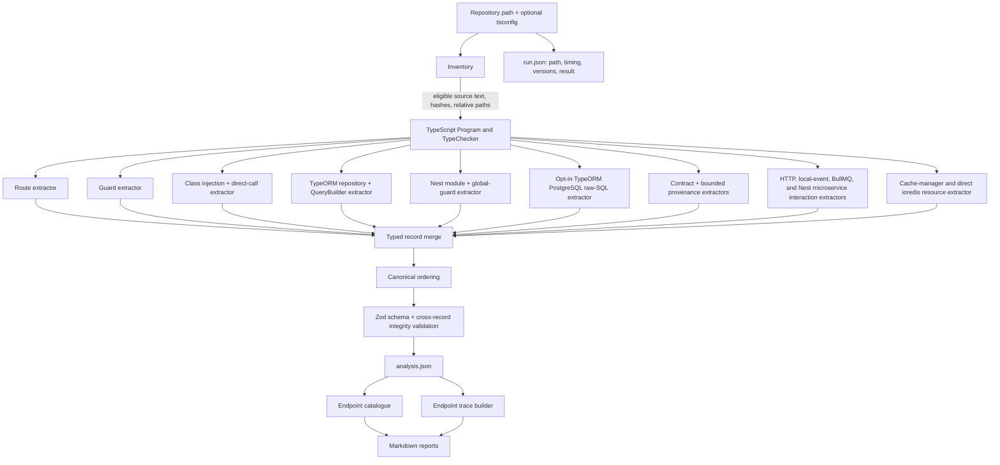
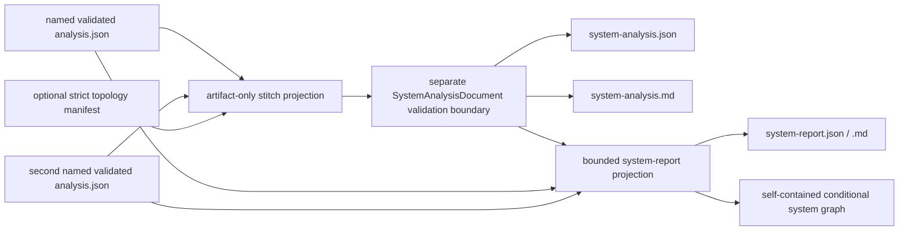
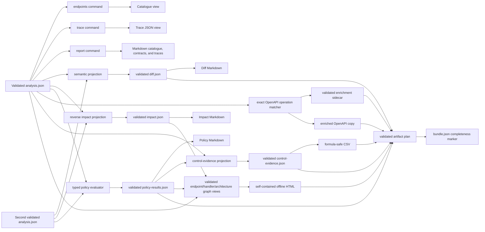
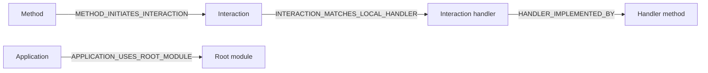

# Architecture

## Pipeline

Cross-service correlation is a separate artifact pipeline. It cannot feed facts back
into any source analysis:

The stitcher reads no repository source or source-control state. Topology supplies
only explicit realm premises; it cannot prove deployment, connection, routing,
delivery, acknowledgement, or consumer execution.

The analyzer does not load target JavaScript modules. Inventory reads eligible source
bytes, then the TypeScript compiler creates syntax trees and a checker. Type
declarations from installed dependencies are used for semantic identity, but target
application code is never imported or evaluated.

### Doctor preflight boundary

`doctor` reuses the safe inventory, project-configuration loader, and no-emit
TypeScript Program/TypeChecker boundary, then stops before all semantic extractors and
artifact writers. Framework recognition requires an imported declaration resolved by
the checker; installed package metadata alone cannot enable a recognition claim. The
separate engine-runtime check resolves the exact packaged dependency assets without
loading target modules or contacting a registry.

Normal output-path inspection reads metadata only. `--probe-output` is the sole write
branch: it creates and removes one exclusive temporary file at the resolved output and
removes only directory components created by that invocation. The result document is
source-safe operational evidence rather than a canonical source-analysis artifact.

## Stage responsibilities

### Safe inventory

Inventory resolves the repository boundary, normalizes repository-relative paths,
hashes source content, and excludes dependencies, VCS data, build output, coverage,
analyzer output, binaries, oversized files, and source symlinks. Eligible target source
is retained in memory so Program construction can reuse the indexed text.

### Semantic index

The TypeScript adapter parses one primary project and exposes a `Program`,
`TypeChecker`, compiler diagnostics, and an index of source files, imports, classes,
constructors, parameters, methods, decorators, and symbols. Package decorator identity
uses resolved imports and declaration files rather than raw names.

### Narrow extractors

Extractors emit typed records, evidence, assertions, and diagnostics. Each relationship
has a stable rule ID. The route extractor establishes endpoint-to-handler facts before
the guard extractor attaches direct declarations. Class and call extraction proves
constructor member bindings and direct calls. TypeORM extraction proves entity/table,
repository/entity, repository-method table access, and bounded QueryBuilder state/table
relationships. QueryBuilder analysis publishes the same method/table predicates and
never publishes generated SQL or a query AST. The separate raw-SQL extractor proves
TypeORM receivers and static sources, then delegates to the pinned PostgreSQL 18
dialect adapter. Its bounded visitor publishes only physical table directions; parser
AST and SQL text stay private. Module extraction proves bounded
imports/providers/exports/controllers plus `APP_GUARD` and direct bootstrap global
registrations. Unsupported or ambiguous behavior is preserved without inventing a
resolved edge.

Interaction extractors prove package-backed HTTP clients, configured in-process
events, the bounded BullMQ queue/worker surface, and bounded Nest microservice
producers/handlers. They publish initiation and local
candidate assertions through the same merge/validation boundary. Queue candidates
remain open-world and distributed-conditional; no extractor contacts a network or
broker.

The resource extractor separately proves package-backed `cache-manager` and direct
`ioredis` operations inside supported Nest classes. It publishes structural key/hash/
keyspace targets through `METHOD_ACCESSES_RESOURCE`; payload arguments and runtime
values are excluded. Pipelines, transactions, scripts, pub/sub, arbitrary wrappers,
and lock semantics remain outside this bounded pass.

The Nest contract extractor inventories supported request decorators and declared or
checker-derived response shapes. It resolves referenced in-repository class/interface
fields without executing mapped-type or validator code. TypeORM persistence extraction
also publishes bounded entity-column declarations and literal option states. These
records are declaration metadata only. The provenance passes may link their field
identities through same-method explicit write sinks and immutable argument-to-parameter
frames over already proven direct calls. Call depth, expression depth, origin sets, and
frame counts are bounded. Reachability alone creates no value flow, and the passes do
not claim exact stored values, runtime validation, naming-strategy output, or
serialization behavior.

### Merge, canonicalization, and validation

Equivalent records from independent extractors are merged by stable ID, with unequal
collisions rejected. Canonicalization sorts records, roles, and evidence references and
recursively orders object keys. Validation then applies both the runtime schema and
cross-record constraints: reference kinds, global ID uniqueness, evidence hashes,
ranges, declaration roles, predicate endpoint kinds, evidence requirements, global
registration linkage/order, and global-state consistency.

Only validated analysis can cross the publication boundary.

## Canonical data versus derived reports

`analysis.json` is the fact source. Endpoint catalogues, traces, module visibility,
and effective guards are deterministic views over canonical assertions and global
registration records; they cannot infer additional routes, calls, guards, module
edges, or table access. This is why `report` can regenerate Markdown without rescanning
source.

`run.json` is intentionally separate. It contains the absolute input path, timestamps,
duration, tool/compiler versions, effective configuration, result state, and run-level
diagnostics. Normalized repeatability comparisons remove its volatile fields.
For CLI scans it also records project-config provenance, effective analysis values,
resolved output, normalized rules, and selected policy/graph/controls/OpenAPI settings.
Only the fact-affecting analysis configuration contributes to the canonical analysis
ID; presentation settings do not.

Two canonical analyses may also enter the comparison boundary. The comparator projects
snapshot-independent semantic tuples, reports collisions instead of guessing, and
publishes a separately versioned `DiffDocument`. Before/after canonical IDs remain in
that document only as audit references. The validated diff, rather than either source
analysis directly, is the sole input to diff Markdown.

The impact projection separately derives source additions, removals, and content-hash
changes from those two canonical inputs. It traverses before and after assertion graphs
with cycle and configured-depth bounds and publishes a separately versioned
`ImpactDocument`. Direct handler/guard changes, reachable changed methods, entity/table
connections, changed persistence facts, and relevant uncertainty remain distinct.
Changed but unreachable source files are reported rather than silently discarded. The
validated impact document is the sole input to impact Markdown.

The policy evaluator consumes the current canonical analysis and, only for diagnostic
comparison, an optional baseline through the semantic diff boundary. Seven fixed,
versioned rules produce explicit pass/fail/unknown/not-applicable results in a separate
validated `PolicyResultsDocument`. Strict JSON configuration selects rules and
severity; it cannot execute code, query arbitrary graph shapes, alter analysis depth
after scanning, or invent facts. Policy Markdown is derived only from that validated
result document.

The structured-export boundary is another derived consumer. OpenAPI enrichment maps
operations only by exact normalized method/path, records ambiguity and misses in a
separately versioned sidecar, and modifies a copy rather than the source document.
The control-evidence projection emits exactly one row per canonical endpoint and may
attach only validated policy results from the same snapshot. Its JSON is authoritative
for that export; CSV is a deterministic, formula-neutralized rendering. Neither
exporter creates canonical records, scans source, or fills gaps with inferred facts.

The offline graph projection consumes validated analysis plus optional same-snapshot
policy and impact documents. It reuses endpoint catalogue, endpoint and interaction-
handler traces, effective-guard, and request-provenance views; it cannot import
extractor internals or create canonical relationships. Every endpoint and canonical
interaction handler receives one bounded scene with explicit omitted counts. Current
analysis v5 also receives one derived repository architecture overview. Its direct-call
degree, supported endpoint/handler trace reach, percentile legends, and module
declaration ownership are recomputed from canonical assertions and bounded traces;
they do not become analysis facts.
The renderer safely embeds the validated view and pinned Cytoscape browser asset in one
HTML file, authorizes exact inline bytes with CSP hashes, blocks connections, and
provides a semantic table fallback. The HTML performs no source scan or client-side
analysis.

Normal package execution resolves the browser distribution from the exact Cytoscape
dependency. Standalone ncc provider distributions cannot rely on that external module
tree: each build copies `cytoscape.min.js` beside its emitted module chunks, where the
renderer finds it before the package fallback. Only that trusted module directory is
eligible for adjacency lookup; the target repository and process entrypoint cannot
shadow the pinned renderer asset. The provider distribution fingerprint covers this
file together with its JavaScript, metadata, and SQL-parser WASM assets.

## Evidence and uncertainty

Every resolved assertion references one or more evidence records. Evidence points to a
hashed source file, uses one-based end-exclusive coordinates, and may include a bounded,
redacted convenience snippet. The source hash, not the snippet, anchors integrity.

Assertions distinguish `resolved`, `ambiguous`, `unresolved`, and `unsupported`.
Diagnostics carry stable codes for gaps that cannot honestly be represented as a
relationship. A successful partial scan uses `completed_with_gaps`; absence of a fact
is never silently converted into a positive claim.

## Publication and cancellation

Standalone artifacts are staged beside their destinations and renamed only after
complete writes. A scan first prepares and validates every selected artifact, including
hashes and protected-input collision checks, then stages the coherent plan.
`bundle.json` is committed last and is the only completeness marker. A generated-report
manifest tracks only tool-owned traces so stale generated reports can be removed after
a successful commit without touching unrelated files. Cancellation before commit
removes staging files and does not replace an existing complete bundle.

## Extension boundary

The current implementation stops at the patterns in [Supported Static-Analysis
Patterns](supported-patterns.md). General polymorphic or higher-order callback flow, dynamic or
non-PostgreSQL SQL, pipes/interceptors/serialization behavior, unsupported HTTP
clients and general RxJS data flow, persistence history, monorepos, unsupported
messaging transports, PDF certification, fuzzy OpenAPI matching, hosted graph
services, unbounded repository-wide rendering, and AI narrative belong to later
phases.
New facts should enter through a deterministic
extractor and the same canonical validation boundary before any reporter consumes them.

### Analysis v8 interaction, branch, authorization, resource, and critical-section boundary

The current scanner supports `outbound_http`, `in_process_event`, `job_queue`, and
`microservice_message`. The chronology below
explains how that current boundary evolved; statements scoped to an earlier phase are
historical, not current capability claims.

Phase 30 adds an inert interaction topology without adding an interaction extractor:

That was the Phase 30 publication state: empty application/interaction/handler
collections and no supported or enabled interaction kinds. It let schema, integrity,
ordering, comparison semantic keys, and generic adjacency stabilize before HTTP or
event facts existed. V1/v2 normalized views still mark interaction families
`unavailable`; they are not treated as a proven empty scan.

Phase 31 activates only `outbound_http`. A dedicated checker-backed extractor runs
after class-call extraction and before persistence extraction, publishes eager
Axios/fetch/Undici interactions and method-initiation assertions, and merges them
through the same canonical ordering and integrity boundary. Application and handler
collections remain empty, and the other three reserved kinds remain unsupported.

Phase 32 extends that same kind with a separate Nest `HttpService` extractor. It
proves constructor member bindings, classifies supported RxJS activation ancestors,
and evaluates bounded symbolic ConfigService/environment target structure without
reading values. `axiosRef` reuses the eager request contract. Cold construction,
proven activation, unsupported activation, target resolution, and external boundary
remain independent canonical dimensions.

Phase 33 activates `in_process_event`. A package-proven extractor inventories HTTP
application roots, supported EventEmitter module registration, injected
`EventEmitter2` producers, and independent `@OnEvent()` handler declarations. Exact
identity matches become one-to-many candidate assertions; registration state remains
orthogonal and only proven registered handlers contribute endpoint causal table
effects. Endpoint and handler-rooted traversal use separate interaction-hop,
ordinary-call-depth, fan-out, and global-state bounds with path-aware cycle
termination.

Activation, process/broker boundary, dispatch timing, and handler registration are
separate states. A local-handler edge means a supported static candidate and cannot
prove delivery. Endpoint traces, Markdown, impact adjacency, semantic comparison, and
graph scenes consume local event paths.

Phase 34 completes the bounded-local milestone. Statically resolved
`EventEmitterModule.forRoot()` wildcard configuration gives handler targets an
explicit pattern/delimiter; a deterministic segment matcher implements `*` and `**`
and retains every matching exact/wildcard listener without ranking. V3 endpoint
traces publish separate synchronous, local-interaction, distributed-conditional,
outbound, and incompleteness fields. Comparison/impact, catalogues, control evidence,
OpenAPI extensions, and graph schema 3 consume those validated facts. Existing
guard-on-write policy and `dbReads`/`dbWrites` remain synchronous by definition.

Distributed Gate D0 freezes isolated BullMQ and Nest microservice topology fixtures,
pinned declaration surfaces, and strict semantic expectation manifests. Phase 35 now
activates only `job_queue`: package-proven `@InjectQueue()`/`Queue.add()` calls match
same-queue `@Processor()` classes extending `WorkerHost` as local queue-wide
candidates. Crossing that edge always yields `distributed_conditional` effects across
a broker/worker boundary. Producer-only and consumer-only topologies are normal;
delivery and remote consumers are not inferred.

Phase 40 preserves the queue-wide handler candidate while adding separate analysis-v4
dispatch, branch-selector, and branch-effect records. Exact producer jobs select only
compatible exact/common/unmatched effects. Unsupported control flow retains effects
under an unknown residual selector. Comparison, impact, Markdown, structured exports,
and graph views consume those records through independently versioned schemas; no
derived view upgrades a candidate edge into broker delivery.

Phase 41 preserves the v4 branch substrate and adds two orthogonal analysis-v5
collections: authorization metadata and metadata-to-guard enforcement relationships.
Extraction runs after direct guard/module facts so a composite wrapper can contribute
an exact guard declaration while a configured mapping can reference an already proven
endpoint or application-global guard. Metadata values are reduced to redacted shape.
The report, comparison, policy, and graph layers consume the relationship state without
turning metadata into a guard or claiming runtime authorization.

Phase 42 keeps analysis v5 frozen and publishes graph v7. A derived architecture pass
counts resolved direct call edges and the number of bounded endpoint/handler traces
that connect to each method, table, or interaction. It clusters only classes and
methods with exactly one resolved Nest module declaration; multiple, incomplete, and
unavailable ownership remain explicit. Percentile heat is a within-snapshot display
aid. Zero supported-root reach is named `not_reached_from_supported_roots`, never dead
or safe to delete.

Phase 43 publishes analysis v6 and adds canonical non-relational resource-access
records without broadening interaction kinds. Endpoint and handler traces, comparison
v5, impact, Markdown, graph v8, and architecture reach metrics consume the same
`METHOD_ACCESSES_RESOURCE` assertion. This preserves structural key identity and
causal class without claiming command execution, success, runtime values, or cache
semantics.

Phase 44 publishes analysis v7. A package-proven Redlock pass runs before generic
call, TypeORM, raw-SQL, and resource extraction and supplies only the exact inline
callbacks they may enter. The merged assertion graph is then projected back onto
`CriticalSectionRecord.effectAssertionIds` by call-site evidence containment. Traces
remove those assertions from the ordinary synchronous path and traverse them under
`critical_section_conditional`; graph v9 renders the lexical scope explicitly. This
pipeline reports dependency and bounded scope without inferring acquisition,
exclusivity, timing, contention, callback execution, or release.

Analysis v8 extends that same pass with internal, non-canonical callback-flow
summaries. It starts only at a package-proven `redlock.using()` terminal, identifies a
directly invoked callable parameter, and propagates the proof backwards through exact
repository method symbols and unchanged positional arguments under fixed hop, state,
and target-candidate limits. At an exact call site, only a proven inline callback is
added to the shared allowed-nested-function set. Existing call, persistence, SQL,
resource, and interaction extractors then traverse that lexical callback normally;
the critical-section containment pass assigns their canonical assertions to the
caller-owned scope. Wrapper-derived resources use
`resource.redlock.verified-wrapper.v1` and a dynamic target rather than copying a
callee-owned key expression. Ambiguity, unsupported callback form, terminal-connected
cycles, and exhausted bounds fail closed and produce v8 diagnostics. No wrapper
selector configuration or naming heuristic can create proof.

Phase 45 leaves this repository-analysis pipeline unchanged. It introduces a separate
`SystemAnalysisDocument` validation boundary for artifact-only stitching.
Source analyses remain independently validated and are referenced through explicit
service namespaces plus namespaced source-record IDs; their record collections are
never merged. Broker realms come only from declared environment/broker aliases and
structural destination fields. Correlation states preserve declared-realm candidates,
target-only candidates, ambiguity, and unmatched inventory, with no delivery or
cross-service causal claim. Phase 46 adds strict named artifact/topology loaders, a
deterministic correlation projection, independent system-document validation, and
atomic JSON/Markdown publication. It never re-enters the scanner or source pipeline.
Phase 47 keeps `SystemAnalysisDocument` schema `1.0.0` frozen and derives a separate
validated `SystemReportDocument` schema `1.0.0` from that document plus the exact
already-loaded source artifacts. Source-local endpoint/handler traces contribute HTTP
roots, namespaced provenance, diagnostics, and worker table/resource effects. Only a
declared-realm candidate can connect producer, broker destination, and candidate
handler; the distributed segment and every downstream effect remain explicitly
conditional. Global node/edge limits affect display only. Typed system policies read
only system-document correlation states and cannot invent deployment facts.

Phase P4.1 adds another pure boundary above explicit before/after system documents and
topology observations. Its comparison scope is declared as a service namespace matrix,
so known absence is distinct from a missing or incompatible artifact. Source-record-
anchored endpoint identities, declared realm aliases, topology bindings, and system
correlations are projected into a strict `SystemImpactDocument`; target text is never
used as a stand-alone producer/consumer identity. Incomplete coverage suppresses the
affected deltas and creates structured uncertainty. Schema `1.0.0` compares only facts
and declared-realm candidate eligibility.

Phase P4.2 is a second pure boundary. It accepts that validated P4.1 document plus the
exact source artifacts for both named sides, verifies their source/system distributed
record coherence, and derives repository-local impact pairs in memory. Locally impacted
HTTP endpoints and changed producers become seeds only if they reach an exact
`declared_realm_candidate`. Traversal then alternates source-local handler traces and
explicit system correlation edges. BullMQ branch facts constrain exact jobs; local
distributed target matches are not substituted for a declared realm. Multi-hop fan-out
has cycle detection and fixed hop, path, effect, and state ceilings.

Schema `2.0.0` retains the P4.1 comparison and adds canonical seeds, hops, table/resource
effects, evidence and assertion provenance, completeness/truncation, omitted counts,
and side-specific graph overlays. Every propagated effect is
`distributed_conditional`; no output proves broker delivery or handler/effect execution.
The system report renderer can apply an overlay without mutating either source report.
See
[Differential System Impact](system-impact.md).

Phase 36 activates `microservice_message`. It inventories direct microservice and
bounded hybrid roots, static TCP/Redis/RMQ/Kafka transports, checker-proven
`ClientProxy.send()`/`emit()` producers, canonical scalar/plain-JSON patterns, and
controller pattern handlers. Exact candidates require matching mode, application,
pattern, and transport. Event candidates may fan out; duplicate request handlers are
ambiguous and non-traversable. Every downstream handler effect remains
`distributed_conditional`; no broker topology, delivery, acknowledgement, or remote
consumer is inferred.

## Vendor-neutral query boundary

Milestone P0 begins above canonical validation and below any MCP or CI adapter. The
query kernel accepts explicitly typed, already validated analysis, comparison, impact,
policy, system-analysis, and system-report documents. It canonicalizes each family
only to derive a content-addressed descriptor, then builds immutable selection indexes
from analysis records. It never scans a repository, imports target code, resolves a
host filesystem path, uses the network, or writes an artifact.

P0.1 exposes exact endpoint and class/method declaration selectors. Route or
declaration collisions remain ordered multiple matches with state `ambiguous`; the
kernel never chooses the first candidate. Every response records its query schema,
source document identity and state, applied hard limit, total and omitted matches,
direct diagnostic IDs, and evidence references.

P0.2 adds bounded endpoint lists and canonical traces, in-memory before/after
comparison and impact, assertion-backed current-snapshot reverse reachability,
structural system-correlation lookup, and filtering over evaluated policy results.
Trace construction, comparison, impact, and system contract identity remain owned by
their existing canonical engines. The query layer supplies selection, pagination,
limits, compact projections, and strict response schemas; it does not fork those
semantics. Later MCP and CI layers must consume this contract rather than recreate
record matching or traversal. See [Vendor-Neutral Query Kernel](query-kernel.md).

## Local MCP startup boundary

Phase P1 adds a separate `api-intel-mcp` process above the vendor-neutral query
kernel. Its startup arguments name exact analysis, system-analysis, and policy-results
JSON files plus an optional named before/after analysis pair. It canonicalizes those
paths, applies fixed pre-read byte and artifact-count limits, reads and validates each
canonical document once, deeply freezes the results, and constructs one immutable role
and resource registry before opening stdio. It does not re-enter scanning,
configuration discovery, source control, or target code.

Stdio is the sole transport and stdout is reserved for protocol frames. Human startup
and transport diagnostics go to stderr. MCP server, engine, query-response, analysis,
system-analysis, and SDK versions remain separate metadata domains. Phase P1.2
registers eight thin tools over P0 operations and three resource shapes: one bounded
registry summary, one exact evidence record, or one exact top-level canonical record.
Tool output remains bounded structured content plus a concise text projection. No
prompt, whole-document resource, remote transport, or mutation capability is exposed.

Phase P1.3 adds an adapter-level 512 KiB ceiling over the complete serialized tool
result, validates bounded resource-template selectors, and yields once before each
synchronous kernel operation so a queued MCP cancellation can stop work before it
begins. Query count/traversal limits still apply below that byte ceiling. A cancellation
cannot preempt JavaScript while an already-running synchronous kernel operation owns
the event loop; no background task is introduced. Frozen adversarial protocol and
synthetic attribution fixtures close Gate MK0 without changing canonical analysis or
query schemas.
See [Local Artifact MCP Server](mcp-server.md).

## Vendor-neutral CI evaluation boundary

Phase P2.1 adds a pure composition layer above canonical analysis, comparison,
potential-impact, and policy artifacts. It validates each document through its owning
schema and integrity rules, proves that all snapshot references describe the supplied
baseline/candidate pair, and rejects analysis-schema, configuration, or toolchain
drift as `incompatible_baseline`. It does not accept repository paths and cannot scan,
check out a branch, use the network, or call a CI provider.

The resulting `CiEvaluationDocument` contains content-addressed provenance and compact
endpoint, impact, policy, diagnostic, and explicit-gap projections. Evidence is
retained as repository-relative one-based coordinates and content hashes without
source snippets. Canonical JSON, Markdown, and a neutral JSONL annotation stream are
derived deterministically. Provider-specific annotation limits and publication remain
outside this boundary. See [Vendor-Neutral CI Evaluation](ci-evaluation.md).

## Reproducible CI scan boundary

Phase P2.2 adds a pure recipe/preflight layer around a validated P2.1 evaluation. Its
`CiScanRecipeManifest` binds baseline and candidate analysis provenance to the exact
engine distribution, structured Node policy, trusted project configuration,
dependency lockfiles and fixed no-lifecycle-script install vectors, repository
revisions, and an explicit topology fingerprint or `not_applicable` state.

The baseline may be scanned in a distinct trusted workspace or supplied as a trusted
content-addressed artifact. Both forms retain dependency provenance. The candidate is
always an isolated untrusted scan with no fork secrets, a read-only repository token,
and read-only access to the trusted baseline cache. Candidate inputs are excluded
from the cache key.

This layer contains no filesystem, process, checkout, installation, scan, network,
cache-provider, or CI-provider implementation. A wrapper owns those effects and must
validate the recipe before publishing the already bounded P2.1 projections. See
[Reproducible CI Scan Recipe](ci-reproducible-scans.md).

P3.1 and P3.2 share one effectful repository-evaluation runner above this pure
boundary. Exact revision checks, canonical path confinement, trusted-baseline
configuration, immutable no-script installs, scans, comparison, impact, policy,
recipe verification, and graph preparation are provider-neutral. GitHub and GitLab
own only event admission, bounded native projections, artifact layout, and final
process publication. A provider cannot silently acquire different analysis semantics.

## GitHub pull-request adapter boundary

Phase P3.1 is the first effectful provider adapter above P2.1/P2.2. The caller checks
out the exact trusted base and untrusted head revisions into separate workspace
directories using ordinary `pull_request`. The adapter verifies canonical real paths,
binds the resulting Git `HEAD` values to required PR base/head SHA inputs, loads
configuration only from the base checkout, verifies exact package-manager
versions and immutable lockfiles, installs with lifecycle scripts disabled, and scans
both directories using the same trusted analysis settings.

The adapter composes comparison, impact, policy, CI evaluation, reproducibility
recipe, and offline graph documents through their existing engines. It verifies the
recipe against the actual Node runtime before publication. GitHub projection is a
bounded presentation layer: error-first annotations, safe candidate-relative file
coordinates, a 64 KiB escaped job summary, and an exact artifact directory. It does
not alter canonical CI semantics or call a provider API.

`action.yml` uploads that directory through a full-SHA-pinned artifact action, then a
final step enforces the stable process exit code. This ordering retains evidence for
policy violations and handled analysis failures without granting comment or write
permissions. `pull_request_target`, candidate configuration, candidate-written
trusted caches, target lifecycle scripts, secrets, and checkout credentials are
outside the boundary. See [GitHub Pull-Request Gate](github-action.md).

## GitLab merge-request adapter boundary

Phase P3.2 packages the shared runner in a separately published OCI image and exposes
it through `templates/api-intel/template.yml`. A GitLab component merges YAML into a
consumer pipeline but does not transfer its own repository files, so image identity is
a mandatory input and must use a registry `sha256` manifest digest. The component
itself must also be included by a full commit SHA.
The component input schema and runtime `CI_JOB_IMAGE` check both reject image
references without an exact `sha256` manifest digest, which is retained in the
provider manifest.

Only `merge_request_event` is admitted. A full-depth checkout provides exact
`CI_MERGE_REQUEST_DIFF_BASE_SHA` and `CI_COMMIT_SHA` objects; the component creates
fresh detached worktrees outside candidate content. The baseline is the stable MR diff
base rather than a moving target-branch name. Candidate content cannot supply trusted
configuration or pre-create the fixed publication directory.

The adapter maps only safe candidate-relative evidence with exact start lines into a
bounded GitLab Code Quality JSON array. Baseline-only, job-level, unsafe-path, and
over-limit findings remain explicit artifact-only counts and canonical records. The
root report has no BOM and no unsupported SARIF or Code Climate fields. GitLab uploads
report artifacts even for nonzero job outcomes; no merge-request note or GitLab API
call is required. See [GitLab Merge-Request Gate](gitlab-ci.md).

## Sanitized CI comment boundary

Phase P5.1 adds a pure projection above one validated `CiEvaluationDocument`. The
caller supplies a bounded run identity and already-published artifact destinations;
the projector performs no network access and accepts only normalized credential-free
HTTPS URLs. It converts the portable annotation stream into a deterministic
failure-first subset, retains exact included/omitted counts, and enforces a 60,000-byte
hard ceiling over the final Markdown.

Repository-derived display text is normalized and fully escaped before rendering.
The document carries a constant engine-owned upsert marker, but P5.1 neither searches
for nor mutates provider comments. Its integrity validator proves internal identity,
limits, and rendered size; a separate source-binding validator proves the evaluation
ID, outcome, summary, candidate provenance, annotation population, and retained
finding prefix against the exact trusted evaluation. See
[Sanitized CI Comment Contract](ci-comment.md).

## Privileged CI comment boundary

Phase P5.2 leaves the P3 analysis adapters unchanged and places GitHub/GitLab mutation
behind separate opt-in library functions. A trusted follow-up job supplies the exact
provider target, numeric bot identity, baseline/candidate revisions, API origin, and
token. Downloaded evaluation/comment documents remain untrusted: strict source
validation and revision binding complete before any token-bearing request.

The adapters perform a bounded list-and-upsert against only a marker-bearing comment
owned by the configured bot. Zero matches create, one match updates or no-ops, and
multiple matches fail closed. Pagination, response size, time, redirects, statuses,
and response shapes are bounded. Authorization-like `401`/`403`/`404` responses become
an explicit nonblocking fallback because native P3 summaries and artifacts already
exist; other transport or integrity failures remain errors. The publisher never runs
target code, checks out a repository, deletes a comment, or changes the CI evaluation
outcome. See [Optional CI Comment Publisher](ci-comment-publisher.md).
